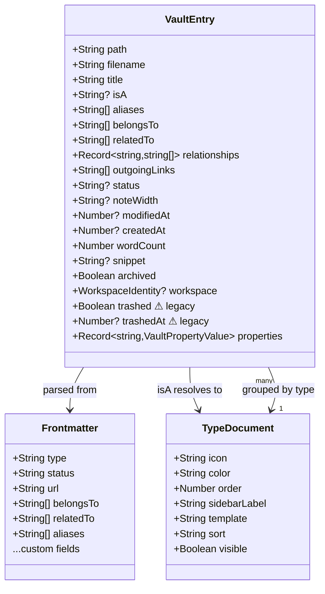
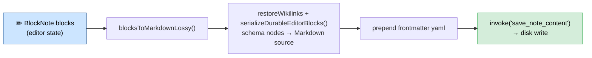

# Abstractions

Key abstractions and domain models in Tolaria.

## Design Philosophy

Tolaria's abstractions follow the **convention over configuration** principle: standard field names, types, and relationships have well-defined meanings and trigger UI behavior automatically. This makes vaults legible both to humans and to AI agents — the more a vault follows conventions, the less custom configuration an AI needs to navigate it correctly.

The full set of design principles is documented in [ARCHITECTURE.md](./ARCHITECTURE.md#design-principles).

## Semantic Field Names (conventions)

These frontmatter field names have special meaning in Tolaria's UI:

| Field | Meaning | UI behavior |
|---|---|---|
| `title:` | Legacy display-title fallback for older notes | Used only when a note has no H1; new notes do not write it automatically |
| `type:` | Entity type (Project, Person, Quarter…) | Type chip in note list + sidebar grouping |
| `status:` | Lifecycle stage (active, done, blocked…) | Colored chip in note list + editor header |
| `icon:` | Per-note icon (emoji, Phosphor name, or HTTP/HTTPS image URL) | Rendered on note title surfaces; editable from the Properties panel |
| `url:` | External link | Clickable link chip in editor header |
| `date:` | Single date | Formatted date badge |
| `start_date:` + `end_date:` | Duration/timespan | Date range badge |
| `goal:` + `result:` | Progress | Progress indicator in editor header |
| `Workspace:` | Vault context filter | Global workspace filter |
| `belongs_to:` | Parent relationship | Humanized to `Belongs to` in the UI |
| `related_to:` | Lateral relationship | Humanized to `Related to` in the UI |
| `has:` | Contained relationship | Humanized to `Has` in the UI |

Relationship fields are detected dynamically — any frontmatter field containing `[[wikilink]]` values is treated as a relationship (see [ADR-0010](adr/0010-dynamic-wikilink-relationship-detection.md)). Tolaria's own default relationship vocabulary uses snake_case on disk, but labels are humanized at render time and existing user-authored keys are left untouched.

### System Properties (underscore convention)

Any frontmatter field whose name starts with `_` is a **system property**:

- It is **not shown** in the Properties panel (neither for notes nor for Type notes)
- It is **not exposed** as a user-visible property in search, filters, or the UI
- It **is editable** directly in the raw editor (power users can access it if needed)
- It is used by Tolaria internally for configuration, behavior, and UI preferences

Examples:
```yaml
_pinned_properties:       # which properties appear in the editor inline bar (per-type)
  - key: status
    icon: circle-dot
_icon: shapes             # icon assigned to a type
_color: blue              # color assigned to a type
_order: 10                # sort order in the sidebar
_sidebar_label: Projects  # override label in sidebar
_width: wide              # rich-editor width override for this note
```

**This convention is universal** — apply it to all future system-level frontmatter fields. When a new feature needs to store configuration in a note's frontmatter (especially in Type notes), use `_field_name` to keep it hidden from normal user-facing surfaces while still stored on-disk as plain text.

The frontmatter parser (Rust: `vault/mod.rs`, TS: `utils/frontmatter.ts`) must filter out `_*` fields before passing `properties` to the UI.

## Document Model

All data lives in markdown files with YAML frontmatter. There is no database — the filesystem is the source of truth.

### Vault Git Capability

Git is a per-vault capability, not a prerequisite for the document model. A vault can be:

| State | Meaning | UI behavior |
|---|---|---|
| Git-backed | The vault path contains a Git repository | History, changes, commits, sync, conflict resolution, remotes, AutoGit, and auto-sync are available according to remote/config state |
| Non-git | The vault path is a plain folder | Markdown scanning, editing, search, and navigation work; Git-dependent status-bar controls and command-palette entries are replaced by `Git disabled` + `Initialize Git for Current Vault` |

Plain folders become Git-backed only when the user explicitly runs Git initialization from the setup dialog, status bar, or command palette. The setup dialog supports "not now" for a one-time dismissal and "never for this vault" for a local per-vault opt-out from future automatic prompts. Features that depend on Git must check both the vault capability and the installation-local `git_enabled` setting instead of assuming every vault has `.git` or that Git chrome is globally visible.

Git initialization is intentionally scoped to dedicated vault folders. When the current non-git folder looks like a broad personal root such as Documents, Desktop, or Downloads and does not already carry Tolaria-managed vault markers, `init_git_repo` refuses to run Git and asks the user to select or create a dedicated subfolder instead.

### VaultEntry

The core data type representing a single note, defined in Rust (`src-tauri/src/vault/mod.rs`) and TypeScript (`src/types.ts`).



```typescript
// src/types.ts
interface VaultEntry {
  path: string              // Absolute file path
  filename: string          // Just the filename
  title: string             // From first # heading, or filename fallback
  isA: string | null        // Entity type: Project, Procedure, Person, etc. (from frontmatter `type:` field)
  aliases: string[]         // Alternative names for wikilink resolution
  belongsTo: string[]       // Parent relationships (wikilinks)
  relatedTo: string[]       // Related entity links (wikilinks)
  relationships: Record<string, string[]>  // All frontmatter fields containing wikilinks
  outgoingLinks: string[]   // All [[wikilinks]] found in note body
  status: string | null     // Active, Done, Paused, Archived, Dropped
  noteWidth?: 'normal' | 'wide' | null // Rich-editor width mode from `_width`
  modifiedAt: number | null // Unix timestamp (seconds)
  // Note: owner and cadence are now in the generic `properties` map
  createdAt: number | null  // Unix timestamp (seconds)
  fileSize: number
  wordCount: number | null  // Body word count (excludes frontmatter)
  snippet: string | null    // First 200 chars of body
  workspace?: WorkspaceIdentity // Mounted-workspace provenance for cross-vault graph entries
  archived: boolean         // Archived flag
  trashed: boolean          // Kept for backward compatibility (Trash system removed — delete is permanent)
  trashedAt: number | null  // Kept for backward compatibility (Trash system removed)
  properties: Record<string, VaultPropertyValue>  // Scalar and scalar-array custom properties
  fileKind?: 'markdown' | 'text' | 'binary'  // Controls editor/raw/preview behavior
}
```

### WorkspaceIdentity

Mounted workspace provenance is renderer-owned metadata attached to `VaultEntry.workspace` when entries are loaded through the registered workspace set. It is not parsed from note frontmatter and is not written into vault files.

```typescript
interface WorkspaceIdentity {
  id: string
  label: string
  alias: string          // Stable prefix used in cross-workspace wikilinks
  path: string           // Absolute workspace root
  shortLabel: string     // Compact note-list badge text
  color: string | null
  icon: string | null
  mounted: boolean
  available: boolean
  defaultForNewNotes: boolean
}
```

The status-bar workspace manager edits installation-local identity and mount state. The alias is the durable user-facing namespace for cross-workspace links such as `[[team/projects/alpha]]`; labels and colors are display affordances only. The default workspace controls where new notes and Type files are created; it is not a claim that only one vault is active. When multiple workspaces are enabled, every mounted available workspace participates in the graph and the active Git repository set.

Git-facing renderer code must pass an explicit repository path instead of assuming a single active vault. Changes and Pulse/history display one selected repository at a time, manual commit selects one target repository, and AutoGit checkpoints iterate every active repository. Diff, file history, note saves, and discarded changes resolve the repository from the note's workspace provenance or from the selected Git surface.

`useGitFileWorkflows` is the renderer abstraction for note-scoped Git file actions. It translates active tabs, visible entries, and modified-file surfaces into the correct repository path for diff/history commands, deleted-note previews, queued editor diff requests, and discard refresh behavior.

### File kinds and binary previews

`VaultEntry.fileKind` comes from the Rust vault scanner and intentionally stays coarse-grained:

| `fileKind` | Source files | UI behavior |
|---|---|---|
| `markdown` or absent | `.md`, `.markdown` | Full Tolaria note model: frontmatter, BlockNote, raw editor, relationships, title sync |
| `text` | UTF-8 editable formats such as `.yml`, `.json`, `.ts`, `.py`, `.sh` | Opens through the raw editor without Markdown note semantics |
| `binary` | Images, audio, video, PDFs, archives, other non-text files | Stays a normal vault file; previewable media and PDFs open in `FilePreview`, unsupported or broken binaries show an explicit fallback |

Asset previewability is inferred in the renderer from the filename extension (`src/utils/filePreview.ts`) rather than stored as a new persisted kind. Supported images render through ``, supported audio/video render through native HTML media controls, and supported PDFs render through the webview's PDF object renderer, all backed by Tauri asset URLs. On Linux AppImage builds, `should_use_external_media_preview` can disable in-webview audio/video rendering so the same file blocks show filename/external-open fallback controls instead of triggering unstable WebKitGTK media playback. Runtime asset access is accumulated only for vault roots Tolaria has loaded in the current app session, because Tauri directory forbids cannot be safely reversed after a vault switch. The "open in default app" action re-enters the active-vault command boundary through `open_vault_file_external` before delegating to the native opener. This keeps the filesystem as source of truth and avoids converting assets into proprietary objects.

### Note Content Freshness

The renderer may cache recently opened or preloaded markdown content, but cached content is only a performance hint. `useTabManagement` can reuse cached text immediately when it carries the same `modifiedAt` and `fileSize` identity as the current `VaultEntry`; otherwise it validates the cached string with the `validate_note_content` Tauri command. That command re-enters the same vault path boundary checks as `get_note_content` and compares the cached text against the current on-disk file bytes. A mismatch, missing file, or unreadable file falls back to the normal fresh-read path and existing missing/unreadable recovery. Background note prefetch is bounded to a small number of concurrent native reads, and a note opened while queued is promoted to foreground instead of waiting behind the prefetch backlog. Note-open entry objects are re-normalized at the tab boundary, so transient reload or bridge payloads with missing display metadata fall back to filename/title defaults before editor chrome renders; entries without a usable path are ignored instead of opening a broken tab.

`useEditorTabSwap` may reuse BlockNote blocks that were already opened successfully or warmed from prefetched raw content, keyed by vault, path, and exact source content. Background warming is limited to likely next large Markdown notes and defers while the editor is unmounted, raw mode is active, or recent typing/navigation is still inside the foreground idle window. Every async editor swap carries a generation and source-content token so stale conversion results cannot overwrite newer file content or dirty editor state.

### Table of Contents Outline

The editor Table of Contents is derived from the live BlockNote document, not from saved Markdown text. `src/utils/tableOfContents.ts` reads structural `heading` blocks with stable ids and levels, extracts inline text from nested BlockNote content, and nests headings by level while preserving document order. `TableOfContentsPanel` receives a document revision from `Editor`, so rich-editor edits refresh the outline immediately without waiting for autosave or a vault reload. Selecting a heading focuses BlockNote and moves the cursor to that block id, while nested headings can be collapsed independently in panel-local UI state.

### Entity Types (isA / type)

Entity type is stored in the `type:` frontmatter field (e.g. `type: Quarter`). The legacy field name `Is A:` is still accepted as an alias for backwards compatibility but new notes use `type:`. The `VaultEntry.isA` property in TypeScript/Rust holds the resolved value.

Type is determined **purely** from the `type:` frontmatter field — it is never inferred from the file's folder location. All notes live at the vault root as flat `.md` files:

```
~/Laputa/
├── my-project.md          ← type: Project (in frontmatter)
├── weekly-review.md       ← type: Procedure
├── john-doe.md            ← type: Person
├── some-topic.md          ← type: Topic
├── AGENTS.md              ← canonical Tolaria AI guidance
├── CLAUDE.md              ← compatibility shim pointing at AGENTS.md
├── GEMINI.md              ← optional Gemini CLI shim pointing at AGENTS.md
├── project.md             ← type: Type (definition document)
├── person.md              ← type: Type (definition document)
├── ...
```

New notes are created at the vault root: `{vault}/{slug}.md`. Changing a note's type only requires updating the `type:` field in frontmatter — the file does not move. Moving a note into a user folder is a separate filesystem concern: the folder path changes, but the note keeps the same filename and `type:` value. Legacy `type/` and `types/` folders are still scanned like other non-hidden vault folders, so existing type documents in those folders continue to work, but new type documents created by Tolaria are written at the vault root. Legacy `config/` content is still recognized during migration and repair, but Tolaria's managed AI guidance now lives at the vault root.

A `flatten_vault` migration command is available to move existing notes from type-based subfolders to the vault root.

### Types as Files

Each entity type can have a corresponding **type document**: any markdown note with `type: Type` in its frontmatter. Tolaria creates new type documents at the vault root (e.g., `project.md`, `person.md`) and still reads existing type documents from subfolders. Type documents:

- Have `type: Type` in their frontmatter (`Is A: Type` also accepted as legacy alias)
- Define type metadata: icon, color, order, sidebar label, template, sort, view, visibility
- Define instance schema/defaults through ordinary custom frontmatter properties and relationship fields
- Are navigable entities — they appear in the sidebar under "Types" and can be opened/edited like any note
- Serve as the "definition" for their type category

**Type document properties** (read by Rust and used in the UI):

| Property | Type | Description |
|----------|------|-------------|
| `icon` | string | Type icon as a Phosphor name (kebab-case, e.g., "cooking-pot") |
| `color` | string | Accent palette key (`red`, `purple`, `blue`, `green`, `yellow`, `orange`, `teal`, `pink`, `gray`) or a valid CSS color value such as `cyan`, `#22d3ee`, or `rgb(34, 211, 238)` |
| `order` | number | Sidebar display order (lower = higher priority) |
| `sidebar_label` | string | Custom label overriding auto-pluralization |
| `template` | string | Markdown template for new notes of this type |
| `sort` | string | Default sort: "modified:desc", "title:asc", "property:Priority:asc"; bare custom-property form such as "Priority:asc" is accepted and normalized in the UI |
| `view` | string | Default view mode: "all", "editor-list", "editor-only" |
| `visible` | bool | Whether type appears in sidebar (default: true) |

**Type relationship**: When any entry has an `isA` value (e.g., "Project"), the Rust backend automatically adds a `"Type"` entry to its `relationships` map pointing to `[[project]]`. This makes the type navigable from the Inspector panel while keeping location as an implementation detail.

**Instance schema/defaults**: Custom scalar/scalar-array properties and relationship fields on a type document define the expected shape for notes of that type. Existing instances do not get mutated when a type changes; the Inspector enriches their real frontmatter with gray placeholders for missing type-defined properties/relationships. Valued type fields are copied into frontmatter only when Tolaria creates a new instance of that type. Blank type fields stay as placeholders.

**UI behavior**:
- Clicking a section group header pins the type document at the top of the NoteList if it exists
- Viewing a type document in entity view shows an "Instances" group listing all entries of that type
- The Type field in the Inspector is rendered as a clickable chip that navigates to the type document

### Frontmatter Format

Standard YAML frontmatter between `---` delimiters:

```yaml
---
title: Write Weekly Essays
type: Procedure
status: Active
belongs_to:
  - "[[grow-newsletter]]"
related_to:
  - "[[writing]]"
aliases:
  - Weekly Writing
---
```

Supported value types (defined in `src-tauri/src/frontmatter/yaml.rs` as `FrontmatterValue`):
- **String**: `status: Active`
- **Number**: `priority: 5`
- **Bool**: `archived: true`
- **List**: Multi-line `  - item` or inline `[item1, item2]`
- **Null**: `owner:` (empty value)

Custom frontmatter fields with scalar values are exposed through `VaultEntry.properties`. Custom fields with scalar arrays are also exposed there, unless any array value contains a wikilink; wikilink-bearing fields belong to `VaultEntry.relationships`. Single-item scalar arrays continue to normalize to their scalar value for compatibility, while multi-item scalar arrays remain arrays so saved view filters can match exact elements.

### Custom Relationships

The Rust parser scans all frontmatter keys for fields containing `[[wikilinks]]`. Any non-standard field with wikilink values is captured in the `relationships` HashMap:

```yaml
---
Topics:
  - "[[writing]]"
  - "[[productivity]]"
Key People:
  - "[[matteo-cellini]]"
---
```

Becomes: `relationships["Topics"] = ["[[writing]]", "[[productivity]]"]`

This enables arbitrary, extensible relationship types without code changes.

### Outgoing Links

All `[[wikilinks]]` in the note body (not frontmatter) are extracted by regex and stored in `outgoingLinks`. Used for backlink detection and relationship graphs.

### Title / Filename Sync

Tolaria separates **display title** from the file identifier:

- **Display title resolution** (`extract_title` in `vault/parsing.rs`): first `# H1` on the first non-empty body line, then legacy frontmatter `title:`, then slug-to-title from the filename stem.
- **Opening a note is read-only**: selecting a note does not inject or auto-correct `title:` frontmatter.
- **Explicit filename actions** (`rename_note`): breadcrumb rename/sync actions stage crash-safe note renames through a hidden `.tolaria-rename-txn/` transaction directory, recover unfinished renames on the next vault scan, update wikilinks across the vault, and surface any failed backlink rewrites instead of silently reporting partial success. The editor body remains the title editing surface.
- **Unicode-aware note stems** (`src/utils/noteSlug.ts`, `vault/rename.rs`): frontend and backend slugging preserve Unicode letters/digits in note filenames, untitled-rename detection, and fallback wikilink targets while still collapsing symbol-only titles to `untitled`.
- **Path identity rules** (`src/utils/notePathIdentity.ts`, `vault/path_identity.rs`): note creation, tab selection, rename bookkeeping, pull refresh, git history, and vault cache updates normalize path separators and macOS `/private/tmp` aliases through one owner. Case folding is reserved for collision/deduplication checks; active-note identity remains case-sensitive.
- **Portable filename validation** (`vault/filename_rules.rs`): note filenames, folder names, and custom view filenames all reject Windows-reserved device names, invalid characters, and trailing dot/space suffixes so a vault created on macOS/Linux still clones and syncs cleanly on Windows.
- **Recoverable save failures** (`useEditorSave`, `vault/file.rs`): invalid platform path syntax is reported as a clear retryable save error, while transient access-denied writes are retried briefly before surfacing failure. The editor keeps the unsaved buffer intact for another attempt.
- **Untitled drafts** start as `untitled-*.md` and are auto-renamed on save once the note gains an H1.

### Title Surface (UI)

The BlockNote body is the only title editing surface:

- The first H1 is the canonical display title.
- There is no separate title row above the editor, even when a note has no H1.
- Notes without an H1 show the editor body and placeholder only.
- Legacy no-H1 notes whose display title differs from the filename show that title as read-only breadcrumb context beside the editable filename, so referenced notes remain identifiable without raw mode.
- Filename changes are explicit breadcrumb actions, not a dedicated title-input side effect.

### Sidebar Selection

Navigation state is modeled as a discriminated union:

```typescript
type SidebarFilter = 'all' | 'archived' | 'changes' | 'pulse'

type SidebarSelection =
  | { kind: 'filter'; filter: SidebarFilter }
  | { kind: 'sectionGroup'; type: string }    // e.g. type: 'Project'
  | { kind: 'folder'; path: string; rootPath?: string }
  | { kind: 'entity'; entry: VaultEntry }      // Neighborhood source note
  | { kind: 'view'; filename: string }
```

`SidebarSelection.kind === 'folder'` is a first-class navigation target, not just a visual highlight.

- `FolderTree` keeps the folder interaction surface decomposed into `FolderTreeRow`, `FolderNameInput`, `FolderContextMenu`, and disclosure/context-menu hooks so nested row rendering, inline rename, and right-click actions stay isolated. The UI wraps backend folder nodes in a synthetic vault-root row with `path: ""` and `rootPath` set to the opened vault so root-level files can be listed without turning the vault root into a mutable folder. Non-mutating reveal/copy-path menu items stay callback-driven from `App` so filesystem convenience actions do not leak into folder mutation hooks.
- `src/components/sidebar/sidebarHooks.ts` owns the shared sidebar interaction primitives for menu positioning/dismissal and inline rename input behavior. Folder, Type, and saved View rows keep their domain-specific actions local, but use those primitives so right-click menus and rename fields have the same outside-click, Escape, focus, blur, and submit semantics.
- `useFolderActions()` composes `useFolderRename()` and `useFolderDelete()` to keep folder mutations selection-aware while the rest of `App.tsx` only wires the resulting callbacks into `Sidebar` and the command registry.
- `useNoteRetargeting()` is the shared retargeting abstraction for note drops and command-palette actions. It owns the "can drop here?" checks, updates `type:` via frontmatter when a note lands on a type section, and delegates folder moves through the same crash-safe rename pipeline used by the backend rename commands.
- A successful folder rename reloads the folder tree plus vault entries, rewrites any affected folder-scoped tabs, and updates `SidebarSelection` to the new relative path when the renamed folder stays selected.
- Folder deletion clears pending rename state, confirms destructive intent, drops affected folder-scoped tabs, reloads vault data, and resets folder selection if the deleted subtree owned the current selection.

### Saved Views

Saved Views live as YAML files under `views/`. Their definition includes user-visible fields (`name`, `icon`, `color`), note-list preferences (`sort`, `listPropertiesDisplay`), filters, and an optional top-level `order` number. The `sort` value accepts built-in sort forms such as `"modified:desc"` and custom-property forms such as `"property:Priority:asc"` or bare `"Priority:asc"`; the renderer keeps configured custom-property sorts visible even when the current result set has no populated values for that property. Filter conditions on scalar-array custom properties, such as `tags: [blues, chicago]`, evaluate `contains`, `any_of`, and related set operators against exact array elements rather than substrings. The `order` value is stored directly in the YAML document, not in Markdown frontmatter, and lower values render earlier in every saved-View list. Views without an explicit order sort after ordered views by filename for stable fallback behavior.

In a mounted-workspace graph, each loaded `ViewFile` carries optional renderer-owned `rootPath` and `workspace` provenance. `SidebarSelection.kind === 'view'` can include that `rootPath`, and view identity is `(rootPath, filename)` rather than filename alone. This lets two vaults both expose `views/focus.yml` without colliding in sidebar selection, note-list filtering, counts, sort/column persistence, edit, or delete flows. A saved View with `rootPath` filters only entries from its own workspace and persists changes through `save_view_cmd` / `delete_view_cmd` against that source vault.

The renderer uses `viewOrdering` helpers to convert drag or command-palette move intent into dense order updates before saving each affected view file through `save_view_cmd`. The sidebar treats saved View rows like Type rows for direct customization: double-click starts inline rename, right-click opens edit/rename/icon-color/delete actions, and keyboard users can open that same menu from the focused row while command-palette actions remain responsible for saved View ordering.

### Neighborhood Mode

`SidebarSelection.kind === 'entity'` is Tolaria's Neighborhood mode for note-list browsing.

- The selected `entry` is the neighborhood source note.
- The source note stays pinned at the top of the note list as a standard active row, not a special card.
- Outgoing relationship groups render first using the note's `relationships` map.
- Inverse groups (`Children`, `Events`, `Referenced by`) and `Backlinks` render after the outgoing groups.
- Empty groups stay visible with count `0`.
- Notes may appear in multiple groups when multiple relationships are true; Neighborhood mode does not deduplicate them across sections.
- Plain click / `Enter` open the focused note without replacing the current Neighborhood.
- Cmd/Ctrl-click and Cmd/Ctrl-`Enter` open the note and pivot the note list into that note's Neighborhood.

## Command Surface

`src/shared/appCommandManifest.json` is the cross-runtime source for stable app command IDs, menu structure, display labels, accelerators, deterministic shortcut QA metadata, and native menu enablement groups. The renderer imports it through `src/hooks/appCommandCatalog.ts`, which derives `APP_COMMAND_IDS`, shortcut lookup maps, Linux titlebar menu sections, native-menu command membership, and test helpers. Tauri includes the same JSON in `src-tauri/src/menu.rs` and uses it to build custom menu items, emit overridden menu item IDs such as the quick-open alias as their primary command IDs, register the Windows main-window menu event bridge, and toggle state-dependent menu items from manifest groups.

Domain command builders still own context-sensitive command-palette entries, availability, and execution callbacks. The manifest owns metadata that must stay identical across native menus, renderer shortcuts, deterministic QA bridges, and the Linux fallback menu; OS-native menu items such as Undo, Copy/Paste, Services, Quit, and Window controls remain local to the native menu implementation.

## File System Integration

### Vault Scanning (Rust)

`vault::scan_vault(path)` in `src-tauri/src/vault/mod.rs`:

1. Validates the path exists and is a directory
2. Recursively scans non-hidden files while skipping hidden directories such as `.git/`
3. For each `.md` file, calls `parse_md_file()`:
   - Reads content with `fs::read_to_string()`
   - Parses frontmatter with `gray_matter::Matter::<YAML>`
   - Extracts title from first `#` heading
   - Reads entity type from `type:` frontmatter field (`Is A:` accepted as legacy alias); type is never inferred from folder
   - Parses dates as ISO 8601 to Unix timestamps
   - Extracts relationships, outgoing links, custom properties, word count, snippet
4. For recognized non-markdown text and binary files, emits a minimal `VaultEntry` with `fileKind`
5. Sorts by `modified_at` descending
6. Skips unparseable files with a warning log

All Notes starts from Markdown notes and excludes Markdown files under `attachments/`. `src/utils/allNotesFileVisibility.ts` resolves the installation-local PDF, image, and unsupported-file toggles from app settings; `noteListHelpers` applies that policy only to All Notes filtering and counts. Folder/root browsing continues to show files from the selected folder independently of those All Notes toggles.

The folder tree hides the legacy `type/` directory, since those type documents already appear through the Types sidebar section. Default vault folders such as `attachments/` and `views/` remain visible alongside user-created folders under the synthetic vault-root row.

Command-facing vault content is filtered through `vault::filter_gitignored_entries`, `vault::filter_gitignored_folders`, and `vault::filter_gitignored_paths` when the app setting `hide_gitignored_files` is enabled. The cache still stores the complete scan; `list_vault`, `reload_vault`, `list_vault_folders`, and search apply the visibility filter at the boundary before React consumes entries. The filter batches paths through `git check-ignore --no-index --stdin`, drains stdout while stdin is still being written, and short-circuits root `.gitignore` detection before walking for nested ignore files, so large ignored folder sets cannot deadlock the native UI while preserving Git semantics as closely as the app can reasonably support.

A `vault_health_check` command detects stray files in non-protected subfolders and filename-title mismatches. On vault load, a migration banner offers to flatten stray files to the root via `flatten_vault`.

Command-layer path access is fenced to the active vault before file operations reach the vault backend. `src-tauri/src/commands/vault/boundary.rs` canonicalizes the configured/requested vault root, rejects `..` escapes and absolute paths outside that root, and validates writable targets through the nearest existing ancestor so note reads, saves, deletes, view-file edits, folder mutations, and image attachment writes cannot step outside the active vault. If the active root itself cannot be canonicalized, the renderer treats `Active vault is not available` the same as no active vault: it clears stale vault state, drops prefetched note content, and shows the missing-vault recovery screen instead of continuing note/view requests against the disappeared path. Image attachment commands add the current vault root to the runtime asset scope after saving so files created under a previously missing `attachments/` directory can render immediately.

Renderer attachment paths are normalized through `src/utils/vaultAttachments.ts`. That module is the single owner for converting between portable markdown references such as `attachments/image.png`, Tauri asset URLs, and absolute active-vault filesystem paths. Editor markdown rendering, raw-mode serialization, image upload/drop handling, file-block open actions, and parsed image cleanup all call this primitive instead of carrying their own asset URL prefixes, Windows path normalization, or `attachments/` join rules.

UI-only file actions operate on paths that are already selected or indexed in React state. Reveal-in-Finder routes through the Tauri opener plugin, external-open routes through the `open_vault_file_external` command and active-vault boundary before invoking the native opener, and copy-path uses the browser clipboard API. Plain-text paste reads the desktop clipboard through `read_text_from_clipboard` in Tauri so macOS WKWebView clipboard permissions do not block the command; browser/mock mode falls back to the Web Clipboard API or mock handlers. None of those actions mutate vault contents or bypass the backend write boundary.

The local MCP WebSocket bridge follows the same active-vault boundary. `useVaultSwitcher` calls `sync_mcp_bridge_vault` after the persisted selection loads and after each vault switch; the desktop command starts/restarts the bridge with the active mounted workspace set in `VAULT_PATHS`, or stops it when there is no selected vault. App exit uses the same child cleanup path and waits for the bridge process after killing it. MCP Node entrypoints accept explicit `VAULT_PATH`/`VAULT_PATHS` for app-owned or legacy launches; durable external registrations omit vault env and resolve the current mounted workspace set from Tolaria's `vaults.json` at tool-call time. Manual MCP config export uses the same packaged `mcp-server/` resolver as registration and app-managed AI agents, including Windows executable-adjacent installs under `%LOCALAPPDATA%\Tolaria`, so the copied snippet stays durable across active-workspace changes without writing third-party config files. Vault context checks each active workspace root for `AGENTS.md` and returns those instructions alongside note counts, folders, and recent notes. Desktop snippet copy goes through the native `copy_text_to_clipboard` command, while browser/mock mode keeps using the Web Clipboard API. External-client stdio MCP processes also exit when stdin closes; their UI-bridge reconnect timers and WebSocket are canceled during shutdown so disconnected clients do not leave extra Node processes behind.

### Vault Caching

`vault::scan_vault_cached(path)` wraps scanning with git-based caching:

1. Reads cache from `~/.laputa/cache/<vault-hash>.json` (external to vault)
2. Compares cache version, vault path, and git HEAD commit hash
3. If cache is valid and same commit → only re-parse uncommitted changed files
4. If different commit → use `git diff` to find changed files → selective re-parse
5. If no cache → full scan
6. Replaces the cache with a temp-file write + rename only if a short-lived writer lock and cache fingerprint check show another scan has not already refreshed it
7. On first run, migrates any legacy `.laputa-cache.json` from inside the vault

### Frontmatter Manipulation (Rust)

`frontmatter/ops.rs:update_frontmatter_content()` performs line-by-line YAML editing:

1. Finds the frontmatter block between `---` delimiters
2. Iterates through lines looking for the target key
3. If found: replaces the value (consuming multi-line list items if present)
4. If not found: appends the new key-value at the end
5. If no frontmatter exists: creates a new `---` block

The `with_frontmatter()` helper wraps this in a read-transform-write cycle on the actual file.

### Content Loading

- **Tauri mode**: Content loaded on-demand when a tab is opened via `invoke('get_note_content', { path })`
- **Browser mode**: All content loaded at startup from mock data
- Content for backlink detection (`allContent`) is stored in memory as `Record<string, string>`

## Git Integration

Git operations live in `src-tauri/src/git/`. All operations shell out to the `git` CLI (not libgit2). Path-producing commands use `core.quotePath=false` so Unicode note filenames stay as UTF-8 paths across status, history, cache invalidation, and rename detection.

### Data Types

```typescript
interface GitCommit {
  hash: string
  shortHash: string
  message: string
  author: string
  date: number       // Unix timestamp
}

interface ModifiedFile {
  path: string          // Absolute path
  relativePath: string  // Relative to vault root
  status: 'modified' | 'added' | 'deleted' | 'untracked' | 'renamed'
}

interface GitRemoteStatus {
  branch: string
  ahead: number
  behind: number
  hasRemote: boolean
}

interface GitAddRemoteResult {
  status: 'connected' | 'already_configured' | 'incompatible_history' | 'auth_error' | 'network_error' | 'error'
  message: string
}

interface PulseCommit {
  hash: string
  shortHash: string
  message: string
  date: number
  githubUrl: string | null
  files: PulseFile[]
  added: number
  modified: number
  deleted: number
}
```

### Operations

| Module | Operation | Notes |
|--------|-----------|-------|
| `history.rs` | File history | `git log` — last 20 commits per file |
| `status.rs` | Modified files | `git status --porcelain` — filtered to `.md` |
| `status.rs` | File diff | `git diff`, fallback to `--cached`, then synthetic for untracked |
| `commit.rs` | Commit | Ensures a local author fallback when needed, then runs `git add -A && git commit -m "..."`; broken signing helpers trigger one unsigned retry for the same app-managed commit |
| `remote.rs` | Pull / Push | `git pull --rebase` / `git push` |
| `connect.rs` | Add remote | Adds `origin`, fetches it, validates history compatibility, and only starts tracking when the remote is safe |
| `conflict.rs` | Conflict resolution | Detect conflicts, resolve with ours/theirs/manual, and ensure a local author fallback before commit/rebase continuation |
| `pulse.rs` | Activity feed | `git log` with `--name-status` for file changes |

### Auto-Sync

`useAutoSync` hook handles automatic git sync:
- Configurable interval (from app settings: `auto_pull_interval_minutes`)
- Pulls on interval, pushes after commits
- Awaits the post-pull vault refresh so toasts land after note-list state is fresh
- Reopens the clean active tab from disk only when the pull changed that active note, so unrelated updates do not remount the editor
- Detects merge conflicts → opens `ConflictResolverModal`
- Tracks remote status (branch, ahead/behind via `git_remote_status`)
- Handles push rejection (divergence) → sets `pull_required` status
- `pullAndPush()`: pulls then auto-pushes for divergence recovery
- `ConflictNoteBanner`: inline banner in editor for conflicted notes (Keep mine / Keep theirs)

### External Vault Refresh

External vault mutations are any disk writes Tolaria did not just perform through its own save path: Git pulls, AI-agent writes, filesystem watcher events, and edits from another app. These changes must route through `refreshPulledVaultState()` rather than calling `reloadVault()` in isolation. The shared refresh abstraction reloads entries, folders, and saved views together, preserves unsaved active-editor content, reopens a clean active note only when the changed-path list includes that note, and closes the active tab if the file disappeared. Unknown or unrelated watcher updates refresh vault-derived state without remounting the active editor. `useVaultWatcher` supplies changed filesystem paths to this abstraction after debouncing and after filtering recent app-owned saves. Overlapping entry reloads and modified-file polls are coalesced with a single trailing rerun so watcher and sync bursts do not stack native vault scans or Git status processes.

`useGitRepositories` is the commit-time companion to `useAutoSync`:
- Owns repository picker validation plus `get_modified_files` and `git_remote_status` loading for active Git repositories
- Re-checks the selected repository when the Commit dialog opens and right before submit
- Converts `hasRemote: false` into a local-only commit path
- Keeps the normal push path unchanged for repositories that do have a remote

`AddRemoteModal` is the explicit recovery path for those local-only vaults:
- Opens from the `No remote` status-bar chip and the command palette
- Calls `git_add_remote` with the current vault path and the pasted repository URL
- Shows auth, network, and incompatible-history failures inline without rewriting the local vault's history

`useAutoGit` is the checkpoint-time companion to both hooks:
- Consumes installation-local AutoGit settings (`autogit_enabled`, idle threshold, inactive threshold)
- Tracks the last meaningful editor activity plus app focus/visibility transitions
- Triggers `useCommitFlow.runAutomaticCheckpoint()` only when the vault is git-backed, pending changes exist, and no unsaved edits remain
- Shares the same deterministic automatic commit message generator with the bottom-bar Commit button, so timer-driven checkpoints and manual quick commits produce the same `Updated N note(s)` / `Updated N file(s)` messages

### Frontend Integration

- **Modified file badges**: Orange dots in sidebar
- **Diff view**: Toggle in breadcrumb bar → shows unified diff
- **Git history**: Shown in Inspector panel for active note
- **Commit dialog**: Triggered from sidebar or Cmd+K
- **No remote indicator**: Neutral chip in the bottom bar when `GitRemoteStatus.hasRemote === false`
- **Pulse view**: Activity feed when Pulse filter is selected
- **Pull command**: Cmd+K → "Pull from Remote", also in Vault menu
- **Git status popup**: Click sync badge → shows branch, ahead/behind, Pull button
- **Conflict banner**: Inline banner in editor with Keep mine / Keep theirs for conflicted notes

## BlockNote Customization

The editor uses [BlockNote](https://www.blocknotejs.org/) for rich text editing, with CodeMirror 6 available as a raw editing alternative.

### Custom Wikilink Inline Content

Defined in `src/components/editorSchema.tsx`:

```typescript
const WikiLink = createReactInlineContentSpec(
  {
    type: "wikilink",
    propSchema: { target: { default: "" } },
    content: "none",
  },
  { render: (props) => <span className="wikilink">...</span> }
)
```

### Code Block Highlighting

Defined in `src/components/editorSchema.tsx` and styled in `src/components/EditorTheme.css`:

- The schema overrides BlockNote's default `codeBlock` spec with `createCodeBlockSpec({ ...codeBlockOptions, defaultLanguage: "text" })` from `@blocknote/code-block`.
- Fenced code blocks now use BlockNote's supported Shiki-backed highlighter path, which renders `.shiki` token spans directly inside the editor DOM.
- Tolaria keeps `defaultLanguage: "text"` so unlabeled code blocks do not silently become JavaScript at creation time. Parsed unlabeled code blocks then run through Tolaria's lightweight language inference, while explicit fence languages and user dropdown choices still win.
- Inline-code chip styling remains scoped to `.bn-inline-content code`, so fenced `pre > code` nodes keep the dedicated code-block shell instead of inheriting the muted inline surface.

### Markdown Math

Defined in `src/utils/mathMarkdown.ts`, `src/components/editorSchema.tsx`, and styled in `src/components/EditorTheme.css`:

- `$...$` becomes a `mathInline` schema node and line-owned `$$...$$` / multiline `$$` blocks become `mathBlock` nodes.
- The rich editor renders both node types through KaTeX with `throwOnError: false`, so malformed formulas keep their source visible instead of breaking the note.
- `serializeMathAwareBlocks()` converts math nodes back to Markdown delimiters before save, raw-mode entry, and editor-position snapshots.
- Raw CodeMirror mode always shows the plain Markdown source, so imported technical notes stay editable outside Tolaria.

### Mermaid Diagrams

Defined in `src/utils/durableMarkdownBlocks.ts`, `src/utils/editorDurableMarkdown.ts`, `src/utils/mermaidMarkdown.ts`, `src/components/MermaidDiagram.tsx`, `src/components/editorSchema.tsx`, and styled in `src/components/EditorTheme.css`:

- Fenced `mermaid` blocks become `mermaidBlock` schema nodes before BlockNote sees the Markdown body.
- Each `mermaidBlock` stores the original fenced Markdown plus the diagram body, so raw-mode entry and saves can restore the canonical source instead of serializing generated SVG.
- The rich editor renders diagrams with the `mermaid` package and uses the original source as an inline fallback when rendering fails.
- `serializeDurableEditorBlocks()` wraps the math-aware serializer so math, wikilinks, Mermaid diagrams, and whiteboards share the same Markdown-first save path.
- The `/mermaid` slash command inserts a placeholder rectangle diagram using the same schema-backed Markdown storage path, avoiding an invalid empty diagram state.

### Tldraw Whiteboards

Defined in `src/utils/durableMarkdownBlocks.ts`, `src/utils/editorDurableMarkdown.ts`, `src/utils/tldrawMarkdown.ts`, `src/components/TldrawWhiteboard.tsx`, `src/components/editorSchema.tsx`, and styled in `src/components/EditorTheme.css`:

- Fenced `tldraw` blocks become `tldrawBlock` schema nodes before BlockNote sees the Markdown body.
- Each `tldrawBlock` stores a stable `boardId` plus the tldraw document snapshot JSON. Session state such as camera, selected tool, and current selection is not persisted into the note.
- The rich editor renders the block with the `tldraw` package and saves debounced document snapshot changes back into the block props, so normal Tolaria autosave writes the board into the `.md` file.
- Whiteboard prop writes re-resolve the live BlockNote block by id before mutating it, and disappear as no-ops if a note reload or mode switch has already removed that block.
- The tldraw runtime receives Tolaria's resolved light/dark mode as its user color scheme, so embedded whiteboards follow the app appearance and update while mounted.
- Mermaid and tldraw both register small codecs with the shared durable fenced-block pipeline; scanner, token, block injection, and mixed serialization mechanics live in one owner.
- The `/whiteboard` slash command inserts an empty tldraw block using the same Markdown-durable storage path. Preview images are intentionally omitted; thumbnails can be added later as derived cache artifacts.

### Formatting Surface Policy

Defined in `src/components/tolariaEditorFormatting.tsx` and `src/components/tolariaEditorFormattingConfig.ts`:

- `SingleEditorView` disables BlockNote's default formatting toolbar, `/` menu, and side menu, then mounts Tolaria-owned controllers so the visible formatting surface matches Tolaria's markdown round-trip guarantees.
- `SingleEditorView` owns a whitespace mouse-selection bridge around BlockNote and its rich-editor scroll area: drag starts that land outside the editable text DOM are remapped through the ProseMirror view with clamped coordinates, while drags below the rendered document fall back to the document end. Drags that begin inside BlockNote's contenteditable surface, toolbars, side menu, dialogs, or non-primary mouse buttons stay on BlockNote/native handling.
- The formatting toolbar only exposes inline controls that persist through `blocksToMarkdownLossy()` in Tolaria's save pipeline: bold, italic, strike, nesting, and link creation. Controls that BlockNote can render temporarily but Tolaria cannot faithfully persist, such as underline, color, alignment, and the block-type dropdown, are hidden instead of appearing to work and later disappearing.
- Tolaria's formatting-toolbar controller also keeps file/image actions mounted across the tiny hover gap between an image block and the floating toolbar, and while the toolbar itself is hovered, so image controls remain usable instead of collapsing mid-interaction.
- `useEditorComposing` tracks editor-owned IME composition events and closes the floating formatting toolbar during composition plus a short post-composition settle window, keeping CJK candidate windows unobstructed without changing normal selection toolbar behavior.
- `createImeCompositionKeyGuardExtension()` intercepts composing `Enter` keydown events before BlockNote's list shortcuts see them, so Korean/Japanese/Chinese IMEs can commit text at the start of list items without Tolaria splitting the current bullet. It stops editor shortcut propagation only; it does not prevent the browser/IME default composition action.
- `useImageLightbox` listens for `dblclick` on the rich-editor container and opens `ImageLightbox` only when the event target resolves to a viewable BlockNote image. The target resolver handles media wrappers, ignores image captions/resize controls, missing sources, and tiny tracking-style images, preserving BlockNote's ordinary single-click image selection path.
- The `/` slash menu remains the supported path for markdown-safe block transformations such as headings, quotes, list blocks, Mermaid diagrams, and whiteboards. Tolaria filters out BlockNote's toggle-heading and toggle-list variants because those do not map cleanly to the markdown note model.
- The block-handle side menu keeps only actions that survive Tolaria's markdown round-trip. Delete and table-header toggles remain available; BlockNote's `Colors` submenu is removed because block colors are not part of Tolaria's supported markdown surface. Tolaria renders the add-block button outside the drag handle so the handle stays next to the block content. The side menu aligns itself to the first rendered text line for the hovered block, so H1/H2 typography, line-height, wrapping, and theme changes do not need per-heading offsets. Block reordering uses a Tolaria-owned pointer gesture and direct BlockNote block moves instead of HTML5 `DataTransfer`, keeping it independent from Tauri's native file-drop system. Block-handle actions re-resolve the current live BlockNote block before mutating or dragging, so note reloads and sync churn cannot leave controls acting on stale block references.
- BlockNote's table row/column handles are patched so stale or missing hovered-table state cancels the drag and hides handles instead of throwing. Add/remove row and column actions also validate the table position and cell indexes before resolving a ProseMirror `CellSelection`, so reloads or menu lag cannot turn stale handles into invalid table-selection positions. Checklist checkbox handlers also re-resolve the live block before updating `checked`, making delayed clicks after note reloads a no-op instead of a stale block mutation. Browser and native table regressions should exercise row and column dragging plus add-menu actions because the state is tracked per orientation.
- `SingleEditorView` wraps the BlockNote surface in a narrow render-recovery boundary for BlockNote's transient `Block doesn't have id` node-view failure. The boundary retries the BlockNote view once, records `editor_render_recovered`, and marks the recovered error so the React root handler does not send that handled case back to Sentry. Other render errors still propagate through the normal root error path.
- `useNoteWikilinkDrop()` is the shared editor-drop abstraction for dragging note rows into either editor mode. It reads the existing note-retargeting drag payload, resolves the vault-relative stem, and inserts a canonical `[[wikilink]]` without hijacking unrelated plain-text drags.
- `plainTextPaste.ts` is the shared plain-text paste target registry. Rich BlockNote and raw CodeMirror surfaces register focused insertion targets, while ordinary focused text controls use DOM selection replacement, so the `Cmd+Shift+V` command can preserve caret/selection behavior without each surface inventing its own clipboard reader.
- `useTauriDragDropEvent()` owns the shared Tauri window drag/drop subscription and duplicate-unlisten cleanup used by native drop features.
- `useNativePathDrop()` is the shared Tauri file/folder-drop abstraction for text inputs that need filesystem paths instead of attachment import. It consumes native window drag/drop events, gates them to the target element bounds or focused text selection, and lets AI composer / command-palette inputs insert formatted paths at the current cursor.

### Markdown-to-BlockNote Pipeline

```mermaid
flowchart LR
    A["📄 Raw markdown\n(from disk)"] --> B["splitFrontmatter()\n→ yaml + body"]
    B --> C["preProcessDurableEditorMarkdown(body)\nmermaid/tldraw fences + file links → tokens"]
    C --> D["preProcessWikilinks(body)\n[[target]] → ‹token›"]
    D --> E["preProcessMathMarkdown(body)\n$...$ / $$...$$ → tokens"]
    E --> F["tryParseMarkdownToBlocks()\n→ BlockNote block tree"]
    F --> G["injectWikilinks + injectMathInBlocks + injectDurableEditorMarkdownBlocks\n tokens → schema nodes"]
    G --> H["editor.replaceBlocks()\n→ rendered editor"]

    style A fill:#f8f9fa,stroke:#6c757d,color:#000
    style H fill:#d4edda,stroke:#28a745,color:#000
```



> Wikilink placeholder tokens use `\u2039` and `\u203A`; math, Mermaid, tldraw, and standalone file-attachment link placeholders use ASCII sentinels with URI-encoded payloads.

### BlockNote-to-Markdown Pipeline (Save)



Rich-editor change events are coalesced before this serialization runs. `useEditorTabSwap` keeps the latest BlockNote state in the editor, schedules one Markdown serialization for a short idle window, and exposes an explicit flush hook for save, note switch, raw-mode entry, and destructive note actions. `src/utils/richEditorMarkdown.ts` is the shared BlockNote-to-Markdown owner for autosave/tab-swap and raw-mode entry, so wikilink restoration, durable schema-node serialization, frontmatter preservation, file-attachment block round-tripping, and portable attachment paths cannot drift between editor modes. This keeps long notes from paying full-document Markdown serialization on every keystroke while preserving the disk-first save path.

Autosave then waits for a 1.5s idle window before invoking `save_note_content`. If an older save resolves after the user has already typed newer content, the older save is treated as stale and cannot clear the newer pending buffer or repaint tab state over it; the latest pending content remains scheduled for its own save.

### Wikilink Navigation

Two navigation mechanisms:

1. **Click handler**: DOM event listener on `.editor__blocknote-container` catches clicks on `.wikilink` elements → `onNavigateWikilink(target)`.
2. **Suggestion menu**: Typing `[[` triggers `SuggestionMenuController` with filtered vault entries.

Wikilink resolution (`resolveEntry` in `src/utils/wikilink.ts`) uses multi-pass matching with global priority: path suffix for path-style targets, filename stem, alias, exact title, then humanized title (kebab-case -> words). In a mounted-workspace graph, unprefixed links prefer the source note's workspace, while links prefixed by a known workspace alias resolve inside that workspace (`[[team/projects/alpha]]`). Cross-workspace canonical link insertion prefixes the target alias only when source and target workspaces differ; same-workspace links stay vault-relative.

### Raw Editor Mode

Toggle via Cmd+K → "Raw Editor" or breadcrumb bar button. Uses CodeMirror 6 (`useCodeMirror` hook) to edit the raw markdown + frontmatter directly. Changes saved via the same `save_note_content` command.
`useRawModeWithFlush` owns the rich/raw transition model: pending raw-exit content and raw-mode overrides move together as one content transition, while cursor/scroll restoration moves through one restore-transition ref consumed by `useEditorModePositionSync`. The raw editor should not carry independent pending-content or pending-position refs outside that handoff.
While the user types, `useEditorSaveWithLinks` derives a transient `VaultEntry` patch from parseable frontmatter so the Inspector, relationship chips, and note-list-visible metadata stay in sync with the raw editor before the next vault reload. Temporarily invalid or half-typed frontmatter is ignored until it becomes parseable again, which avoids clobbering the last known good derived state.

Current-note find/replace is intentionally backed by raw CodeMirror mode. `Cmd+F`, "Find in Note", and "Replace in Note" switch the active Markdown/text note to raw mode, show the compact find bar above CodeMirror, and operate on the current note only. Plain text matching is case-insensitive by default, `Aa` toggles case sensitivity, `.*` toggles JavaScript-regex matching, and regex replacement supports capture groups through JavaScript replacement syntax.

### Rich Editor Width Modes

Rich Markdown editing supports `normal` and `wide` note widths. The effective mode is resolved in `App.tsx` from, in order, the current session's transient note-width cache, `VaultEntry.noteWidth` parsed from `_width`, and the installation-local `settings.note_width_mode` default. The breadcrumb toggle calls the same setter exposed through the command palette.

Per-note width is persisted as hidden `_width` frontmatter only when the note already has a valid or empty frontmatter block. Notes without frontmatter use the transient cache for the current session, so toggling width never creates frontmatter solely to store UI state. The width class is applied around `SingleEditorView` only; raw CodeMirror mode stays outside `.editor-content-wrapper` and remains full-width.

### Arrow Ligature Normalization

Typed ASCII arrow sequences are normalized consistently in both editor modes:

- Rich editor input mounts `createArrowLigaturesExtension()` (`src/components/arrowLigaturesExtension.ts`) into BlockNote and intercepts typed `beforeinput` events before ProseMirror commits the character.
- Raw editor input uses the CodeMirror `inputHandler` path in `useCodeMirror` so the same ligature rules apply while editing markdown source directly.
- Both paths delegate to the shared `resolveArrowLigatureInput()` helper in `src/utils/arrowLigatures.ts`, which prioritizes `<->` over partial matches, keeps paste literal, and lets escaped forms such as `\\->` and `\\<->` remain ASCII.
- The rich-editor extension treats stale, disconnected, or mid-reload ProseMirror views as a no-op. It never blocks the native input path unless it has already built and dispatched a valid ligature transaction.

## Styling

The app uses internal light and dark themes owned by Tolaria, with System as an installation-local preference that follows the OS appearance (see [ADR-0081](adr/0081-internal-light-dark-theme-runtime.md) and [ADR-0112](adr/0112-system-theme-mode.md)). The previous vault-authored theming system remains removed.

1. **Global CSS variables** (`src/index.css`): Semantic app colors, borders, surfaces, and interaction states via `:root` / `[data-theme]`, bridged to Tailwind v4
2. **Editor theme** (`src/theme.json`): BlockNote typography, flattened to CSS vars by `useEditorTheme`
3. **Runtime theme bridge**: Resolves the selected preference to `light` / `dark`, applies `data-theme` and `.dark` for shadcn/ui, and subscribes to `prefers-color-scheme` while System is selected
4. **Theme mode commands**: Command-palette actions for Light, Dark, and System call the same `saveSettings` path as the Settings panel and persist only `settings.theme_mode`

## Localization

App UI strings are resolved through `src/lib/i18n.ts`, with flat JSON catalogs in `src/lib/locales/*.json` (see [ADR-0087](adr/0087-json-catalogs-and-lara-cli-localization.md)):

- `AppLocale`: canonical locale tags such as `'en'`, `'zh-CN'`, `'fr-FR'`, `'es-419'`
- `UiLanguagePreference`: `'system' | AppLocale`; persisted settings serialize `system` as `null`
- `resolveEffectiveLocale()`: maps an explicit preference or system/browser language list to the effective supported locale, including legacy aliases
- `translate()` / `createTranslator()`: resolve keys with English fallback and simple `{name}` interpolation
- `scripts/validate-locales.mjs`: asserts every checked-in locale catalog matches the English keyset and stays flat-string-only

`App.tsx` owns the effective locale and passes it to localized app chrome through props. Settings and command-palette language commands call back into `saveSettings`, so UI language changes update the current session without touching vault content or reopening the vault.

## Inspector Abstraction

The Inspector panel (`src/components/Inspector.tsx`) is composed of sub-panels:

1. **DynamicPropertiesPanel** (`src/components/DynamicPropertiesPanel.tsx`): Renders frontmatter as editable key-value pairs:
   - **Editable properties** (top): Type badge, Status pill with dropdown, number fields, boolean toggles, array tag pills, text fields. Click-to-edit interaction.
   - **Property display modes**: `text`, `number`, `date`, `boolean`, `status`, `url`, `tags`, and `color`. Numeric frontmatter values auto-detect as `number`, and custom scalar keys can be explicitly switched to `Number` through the property-type control.
   - **Present empty properties**: A top-level frontmatter key with a blank scalar value (for example `start date:`) is treated as present and renders as an editable empty row. Only absent keys are omitted.
   - **Type-derived placeholders**: For typed instances, missing custom properties declared on the type document render as gray editable placeholders. Editing one writes the value to the instance frontmatter; merely displaying it does not backfill the note.
   - **Info section** (bottom, separated by border): Read-only derived metadata — Modified, Created, Words, File Size. Uses muted styling with no interaction.
   - Keys in `SKIP_KEYS` (`type`, `aliases`, `notion_id`, `workspace`, `is_a`, `Is A`) are hidden from the editable section.

2. **RelationshipsPanel**: Shows `belongs_to`, `related_to`, `has`, and all custom relationship fields as clickable wikilink chips. Relationship labels are humanized for display, but stored keys remain unchanged. For typed instances, missing relationship fields declared on the type document render as gray editable placeholders without copying any default relationship targets into existing notes.

3. **BacklinksPanel**: Scans `allContent` for notes that reference the current note via `[[title]]` or `[[path]]`.

4. **GitHistoryPanel**: Shows recent commits from file history with relative timestamps.

## Search

### Search

Keyword-based search scans all vault `.md` files using `walkdir` and applies the same Gitignored-content visibility filter as vault loading:

```typescript
interface SearchResult {
  title: string
  path: string
  snippet: string
  score: number
}
```

### Search Integration

`SearchPanel` component provides the search UI:
- Real-time results as user types (300ms debounce)
- Click result to open note in editor
- Shows relevance score and snippet

No indexing step required — search runs directly against the filesystem.

## Vault Management

### Vault Switching

`useVaultSwitcher` hook manages multiple vaults:
- Persists vault list to `~/.config/com.tolaria.app/vaults.json` (reads legacy `com.laputa.app` on upgrade)
- Switching closes all tabs and resets sidebar
- Supports adding, removing, hiding/restoring vaults
- Persists workspace aliases, colors, mount state, and the default new-note destination for the unified graph
- Default vault: public Getting Started starter vault cloned on demand

Mounted workspaces are loaded together by `useVaultLoader` for note-list, quick-open, keyword search, wikilink navigation, and saved View discovery. Workspace switching remains a focus operation for per-vault capabilities (Git status, folders, AutoGit, watchers, and repair commands), not a graph isolation boundary.

### Vault Config

Per-vault settings stored locally and scoped by vault path:
- Managed by `useVaultConfig` hook and `vaultConfigStore`
- Settings: zoom, view mode, editor mode, tag colors, status colors, property display modes, Inbox/All Notes note-list column overrides, explicit organization workflow toggle, Git setup prompt preference, AI agent permission mode (`safe` / `power_user`)
- Missing, null, and unknown AI agent permission modes normalize to `safe`; the AI panel can switch modes per vault, preserving the transcript and applying the new mode only to the next agent run
- One-time migration from localStorage (`configMigration.ts`)

Installation-local layout state that should not sync through a vault stays in localStorage. `useLayoutPanels` stores the clamped sidebar, note-list, and inspector widths under `tolaria:layout-panels` so pane sizing survives app relaunches on the same machine.

### AI Guidance Files

Tolaria tracks managed vault-level AI guidance separately from normal note content:
- `AGENTS.md` is the canonical managed guidance file for Tolaria-aware coding agents
- `CLAUDE.md` is a compatibility shim that points Claude Code back to `AGENTS.md`
- `GEMINI.md` is an optional Gemini CLI compatibility shim that points Gemini back to `AGENTS.md`
- `useVaultAiGuidanceStatus` reads `get_vault_ai_guidance_status` and normalizes the backend state into four UI cases: `managed`, `missing`, `broken`, and `custom`
- `restore_vault_ai_guidance` repairs only Tolaria-managed files and creates the optional Gemini shim on explicit request; user-authored custom `AGENTS.md` / `CLAUDE.md` / `GEMINI.md` files are surfaced as custom and left untouched
- The status bar AI badge and command palette consume that abstraction to expose restore actions only when the managed guidance is missing or broken

Vault guidance is intentionally short and vault-specific. General Tolaria product behavior is delivered through the bundled agent docs resource instead:
- `scripts/build-agent-docs.mjs` compiles the public `site/` Markdown into `src-tauri/resources/agent-docs/`
- `src-tauri/resources/agent-docs/AGENTS.md` orients agents to the generated docs bundle, while `index.md`, section bundles, `all.md`, `search-index.json`, and `pages/` provide fast local lookup
- `get_agent_docs_path` exposes the resolved resource folder to the renderer, and `buildAgentSystemPrompt()` tells every app-managed CLI agent to read vault `AGENTS.md` first, then search the bundled docs for Tolaria behavior

### Getting Started / Onboarding

`useOnboarding` hook detects first launch:
- If vault path doesn't exist → show `WelcomeScreen`
- User can create a new empty vault, open an existing folder, or clone the public Getting Started vault into a chosen parent folder; Tolaria derives the final `Getting Started` child path before cloning
- After the starter repo clone completes, Tolaria removes every remote so the new vault opens local-only by default
- Welcome state tracked in localStorage (`tolaria_welcome_dismissed`, with legacy fallback)

`useGettingStartedClone` encapsulates the non-onboarding Getting Started action:
- Opens the same parent-folder picker used by onboarding
- Derives the final `.../Getting Started` destination path
- Surfaces the resolved path through the app toast after a successful clone

`useAiAgentsOnboarding(enabled)` adds a separate first-launch agent step:
- Reads a local dismissal flag for the AI agents prompt (with a legacy fallback to the older Claude-only key)
- Only shows after vault onboarding has already resolved to a ready state
- Uses `get_ai_agents_status`, whose backend checks Claude Code, Codex, OpenCode, Pi, Gemini, and Kiro by treating the app process path, login-shell path, and supported local/toolchain/app install locations, including nvm-managed Node installs plus Windows `.exe` and npm/pnpm/Scoop shim paths, as valid CLI-agent sources
- Persists dismissal locally once the user continues

### Remote Git Operations

Tolaria delegates remote auth to the user's system git setup:
- `CloneVaultModal` captures a remote URL and local destination
- `clone_git_repo` and `create_getting_started_vault` both run system git clone work in blocking Tokio tasks so clone UIs stay responsive
- On macOS, system-git commands prefer the user's login-shell `git` and `PATH`, and `git_add_remote` preflights HTTPS remotes through `git credential fill` so Keychain can prompt/grant access before the first fetch or push
- On Linux AppImage launches, every system-git command and MCP runtime subprocess (Node.js or Bun) removes AppImage loader overrides such as `LD_LIBRARY_PATH`, `LD_PRELOAD`, and `GIT_EXEC_PATH` before spawning, so helpers like `git-remote-https` and the system MCP runtime bind against the host library stack instead of Tolaria's bundled WebKit/AppImage libraries
- On native Linux Wayland launches and Linux AppImage launches, startup environment safeguards set `WEBKIT_DISABLE_DMABUF_RENDERER=1` and `WEBKIT_DISABLE_COMPOSITING_MODE=1` unless the user already provided either variable, keeping WebKitGTK rendering crashes out of the app startup path while leaving native X11 launches unchanged.
- On Linux AppImage launches, release packaging bundles the GTK3 fcitx immodule into the AppImage and startup environment safeguards write a cache-local `GTK_IM_MODULE_FILE` that points GTK at the mounted module whenever fcitx is configured. If the user has not explicitly chosen a GTK IM module, Tolaria also sets `GTK_IM_MODULE=fcitx`, allowing WebKitGTK editor input to reach fcitx5 on both Wayland and X11 fallback launches without relying on host GTK module cache paths.
- `git_add_remote` uses the same system git path and refuses remotes whose history is unrelated or ahead of the local vault
- Existing `git_pull` / `git_push` commands keep surfacing raw git errors, and clone commands fail fast when git wants interactive terminal input
- No provider-specific token or username is stored in app settings

## Settings

App-level settings persisted at `~/.config/com.tolaria.app/settings.json` (reads legacy `com.laputa.app` on upgrade):

```typescript
interface Settings {
  auto_pull_interval_minutes: number | null
  autogit_enabled: boolean | null
  autogit_idle_threshold_seconds: number | null
  autogit_inactive_threshold_seconds: number | null
  telemetry_consent: boolean | null
  crash_reporting_enabled: boolean | null
  analytics_enabled: boolean | null
  anonymous_id: string | null
  release_channel: string | null // null = stable default, "alpha" = every-push prerelease feed
  theme_mode: 'light' | 'dark' | 'system' | null
  ui_language: AppLocale | null
  date_display_format: 'us' | 'european' | 'friendly' | 'iso' | null
  note_width_mode: 'normal' | 'wide' | null
  sidebar_type_pluralization_enabled: boolean | null // null = default true
  ai_features_enabled: boolean | null // null = default true
  git_enabled: boolean | null // null = default true
  default_ai_agent: 'claude_code' | 'codex' | 'opencode' | 'pi' | 'gemini' | 'kiro' | null
  default_ai_target: string | null // "agent:codex" or "model:<provider>/<model>"
  ai_model_providers: AiModelProvider[] | null
  hide_gitignored_files: boolean | null // null = default true
  all_notes_show_pdfs: boolean | null // null = default false
  all_notes_show_images: boolean | null // null = default false
  all_notes_show_unsupported: boolean | null // null = default false
}
```

Managed by `useSettings` hook and `SettingsPanel` component. `theme_mode` is installation-local because it controls device comfort rather than vault structure; the Settings panel and command-palette Light/Dark/System actions both update that same value. `system` remains a stored preference, while the runtime resolves it to `light` or `dark` for `data-theme` and app consumers. `ui_language` is also installation-local: `null` follows the supported system language with English fallback, while explicit values pin the UI language for this installation. Stored legacy aliases such as `zh-Hans` are normalized to canonical locale codes before the setting reaches React state. `date_display_format` is installation-local and controls rendered dates in note rows, property chips/cells, note info, table-of-contents metadata, and search result subtitles; `AppPreferencesProvider` owns the UI-level value so rendering surfaces can consume it without prop forwarding, while date picker text input remains ISO for predictable manual entry and storage. `note_width_mode` is the installation-local default for rich-editor note width; individual notes can override it with `_width` when they already have frontmatter. `sidebar_type_pluralization_enabled` is installation-local and defaults to `true`; when false, type rows use exact type names unless the type document defines an explicit `sidebar_label` override. `ai_features_enabled` is installation-local and defaults to `true`; when false, Tolaria hides AI panel controls, status bar AI indicators, command-palette AI mode, and missing-agent prompts while leaving Settings as the re-enable path. `git_enabled` is also installation-local and defaults to `true`; when false, Tolaria hides Git status-bar entries and command-palette actions, disables AutoGit controls, and avoids background Git refresh/sync work while leaving Settings as the re-enable path. `default_ai_agent` remains the legacy installation-local CLI fallback. `default_ai_target` is the active AI target used by the AI panel and status bar; it can point at a coding agent or a configured direct model. `ai_model_providers` stores non-secret provider metadata for local/API model targets, while hosted API keys live in Tolaria's local app-data secrets file or user-managed environment variables instead of being persisted in app settings. Provider defaults and local/API grouping come from the shared `src/shared/aiModelProviderCatalog.json` catalog used by both renderer settings and the Tauri direct-model runtime. `hide_gitignored_files` is also installation-local and defaults to `true`; changing it reloads entries, search, saved views, and folders without restarting. The `all_notes_show_pdfs`, `all_notes_show_images`, and `all_notes_show_unsupported` flags are installation-local All Notes category toggles that default off and update the list/counts without changing vault files. The AutoGit fields are also installation-local: `useAutoGit` consumes them to schedule automatic checkpoints, while `useCommitFlow` and the status bar quick action reuse the same checkpoint runner and deterministic automatic commit message generation.

## Telemetry

### Components
- **`TelemetryConsentDialog`** — First-launch dialog asking user to opt in to anonymous crash reporting. Two buttons: accept (sets `telemetry_consent: true`, generates `anonymous_id`) or decline.
- **`TelemetryToggle`** — Checkbox component in `SettingsPanel` for crash reporting and analytics toggles.

### Hooks
- **`useTelemetry(settings, loaded)`** — Reactively initializes/tears down Sentry and PostHog based on settings. Called once in `App`.

### Libraries
- **`src/lib/telemetry.ts`** — `initSentry()`, `teardownSentry()`, `initPostHog()`, `teardownPostHog()`, `trackEvent()`. Path scrubber via `beforeSend` hook. DSN/key from `VITE_SENTRY_DSN` and `VITE_POSTHOG_KEY`; `VITE_SENTRY_RELEASE` is treated as the build version and only becomes Sentry's `release` for stable calendar builds (`YYYY.M.D`). Alpha/prerelease/internal builds tag `tolaria.build_version` and `tolaria.release_kind` without creating normal Sentry Releases entries.
- **`src/main.tsx`** — React root error callbacks (`onCaughtError`, `onUncaughtError`, `onRecoverableError`) forward component-stack context to `Sentry.reactErrorHandler()` for debuggable production React errors.
- **`src-tauri/src/telemetry.rs`** — Rust-side Sentry init with `beforeSend` path scrubber. `init_sentry_from_settings()` reads settings and conditionally initializes; stable calendar `CARGO_PKG_VERSION` values become Sentry releases, while alpha/prerelease/internal versions are kept as diagnostic tags only. `reinit_sentry()` for runtime toggle.

### Product Events
- **File previews** — `file_preview_opened`, `file_preview_action`, and `file_preview_failed` report only preview/action categories such as `image`, `pdf`, `unsupported`, `open_external`, `copy_path`, and `reveal`.
- **Inline image lightbox** — `inline_image_lightbox_opened` records that a rich-editor inline image was opened from double-click, without sending note paths, image URLs, alt text, or file names.
- **Code block copy** — `code_block_copied` records that the rich-editor code-block copy action was used, without sending note paths, languages, or code content.
- **AI agent sessions** — `ai_agent_message_sent`, `ai_agent_message_blocked`, `ai_agent_response_completed`, `ai_agent_response_failed`, and `ai_agent_permission_mode_changed` use only agent ids, permission modes, counts, and coarse status categories.
- **AI feature visibility** — `ai_features_visibility_changed` records only whether installation-level AI surfaces were enabled or hidden.
- **All Notes visibility** — `all_notes_visibility_changed` records only the toggled category and enabled state.

### Tauri Commands
- **`reinit_telemetry`** — Re-reads settings and toggles Rust Sentry on/off. Called from frontend when user changes crash reporting setting.

---

## Updates & Feature Flags

### Hooks
- **`useUpdater(releaseChannel)`** — Channel-aware updater state machine. Checks the selected feed, surfaces checking/available/downloading/ready states, and delegates install work to Rust.
- **`useFeatureFlag(flag)`** — Returns boolean for a named feature flag. Checks `localStorage` override (`ff_<name>`), then falls back to telemetry-backed evaluation. Type-safe via `FeatureFlagName` union.

### Frontend helpers
- **`src/lib/releaseChannel.ts`** — Normalizes persisted channel values so legacy or invalid settings fall back to Stable, while Stable serializes back to `null`.
- **`src/lib/appUpdater.ts`** — Thin wrapper around the Tauri updater commands. Keeps the React hook free of endpoint-selection details.

### Rust
- **`src-tauri/src/app_updater.rs`** — Chooses the correct update endpoint and adapts Tauri updater results into frontend-friendly payloads. Stable uses the public `stable/latest.json` feed. Alpha first resolves the newest non-draft `alpha-vYYYY.M.D-alpha.NNNN` GitHub Release asset named `alpha-latest.json`, then falls back to the public `alpha/latest.json` feed if the release lookup is unavailable.
- **`src-tauri/src/commands/version.rs`** — Formats app build/version labels for the status bar, including calendar alpha labels and legacy release compatibility.

### Tauri Commands
- **`check_for_app_update`** — Channel-aware update manifest lookup.
- **`download_and_install_app_update`** — Channel-aware download/install with streamed progress events.

### CI/CD
- **`.github/workflows/release.yml`** — Alpha prereleases from every push to `main` using calendar-semver technical versions (`YYYY.M.D-alpha.N`) and clean `Alpha YYYY.M.D.N` release names. GitHub alpha tags zero-pad the prerelease sequence (`alpha-vYYYY.M.D-alpha.NNNN`) so GitHub release ordering stays chronological while the shipped app version remains `YYYY.M.D-alpha.N`. Publishes `alpha/latest.json` with macOS Apple Silicon/Intel, Linux x64, and Windows x64 updater entries, then refreshes the legacy `latest.json` / `latest-canary.json` aliases to the alpha feed. The Linux job uses Tauri's stock linuxdeploy AppImage output plugin and validates that installer and updater-signature artifacts exist before upload. The docs/release Pages job reads the stable manifest from the latest stable release asset instead of copying the live Pages URL, uploads the built site as a Pages artifact, and deploys it with GitHub's official Pages action so the public updater JSON changes as part of the release workflow. macOS release assets use `Tolaria_<version>_macOS_Silicon` and `Tolaria_<version>_macOS_Intel` base names. Packaged builds pass the computed version as `VITE_SENTRY_RELEASE`, which is retained as a diagnostic build-version tag but not registered as a normal Sentry release for alpha builds.
- **`.github/workflows/release-stable.yml`** — Stable releases from `stable-vYYYY.M.D` tags. Publishes `stable/latest.json`, macOS Apple Silicon and Intel DMG/updater artifacts, Windows x64 installers/updater bundles, Linux x86_64 `.deb` / `.rpm` / AppImage artifacts, and a static public download page that starts the selected installer without replacing the page with a blank download navigation. Linux visitors default to the AppImage target while the page exposes RPM as a manual Linux package option when the stable release includes one. The Linux job uses the same stock Tauri/linuxdeploy AppImage packaging and artifact validation as alpha releases. The Pages job reads the alpha manifest from the latest alpha release asset instead of copying the live Pages URL, uploads the built site as a Pages artifact, and deploys it with GitHub's official Pages action so stable and alpha manifests stay fresh. Stable macOS DMG/updater assets use the same `Tolaria_<version>_macOS_Silicon` and `Tolaria_<version>_macOS_Intel` base names. Packaged builds pass the computed stable version as `VITE_SENTRY_RELEASE`, which is registered as Sentry's release.
- **Beta cohorts** are handled in PostHog targeting only. There is no beta updater feed.
