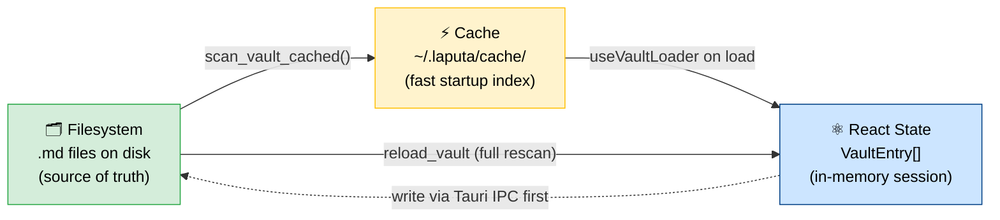
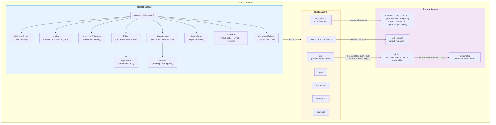
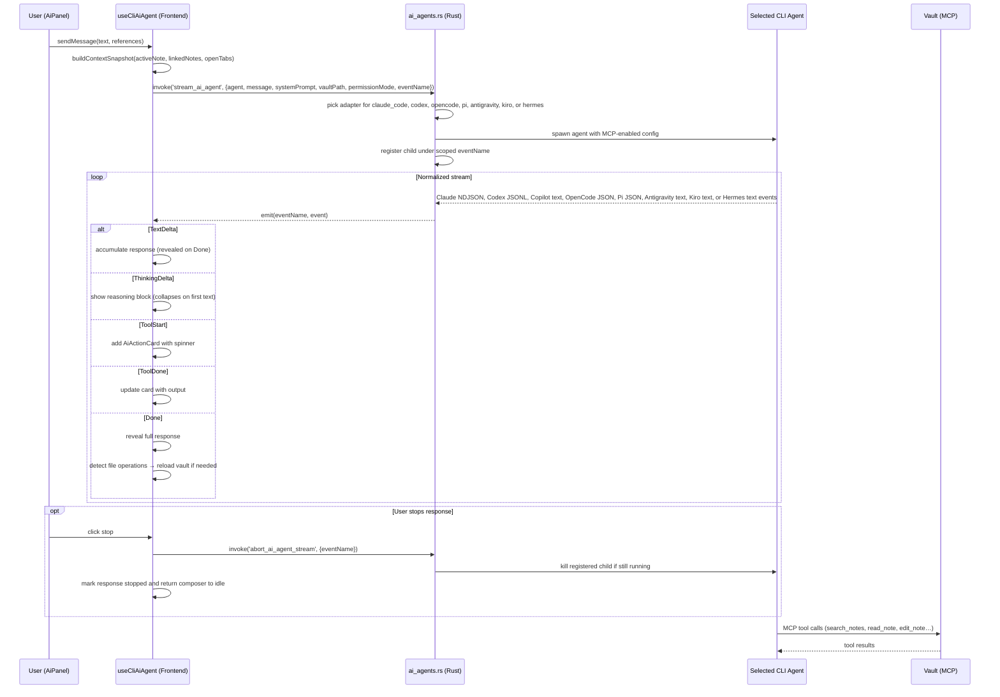
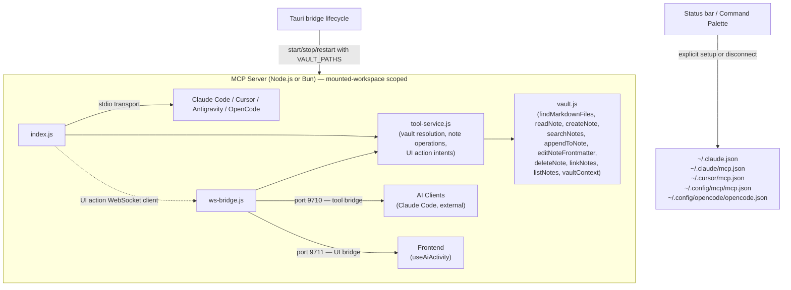
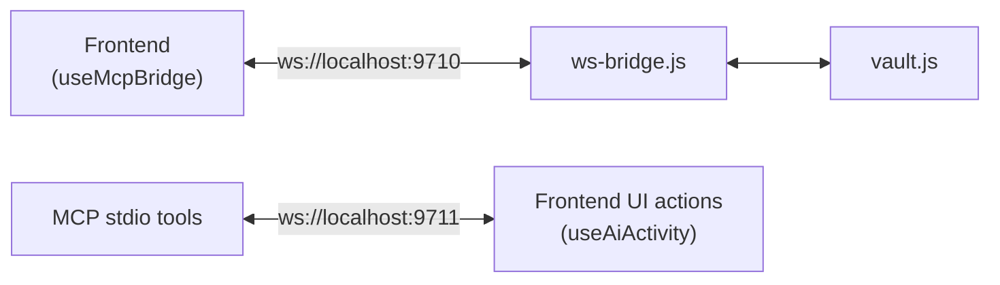
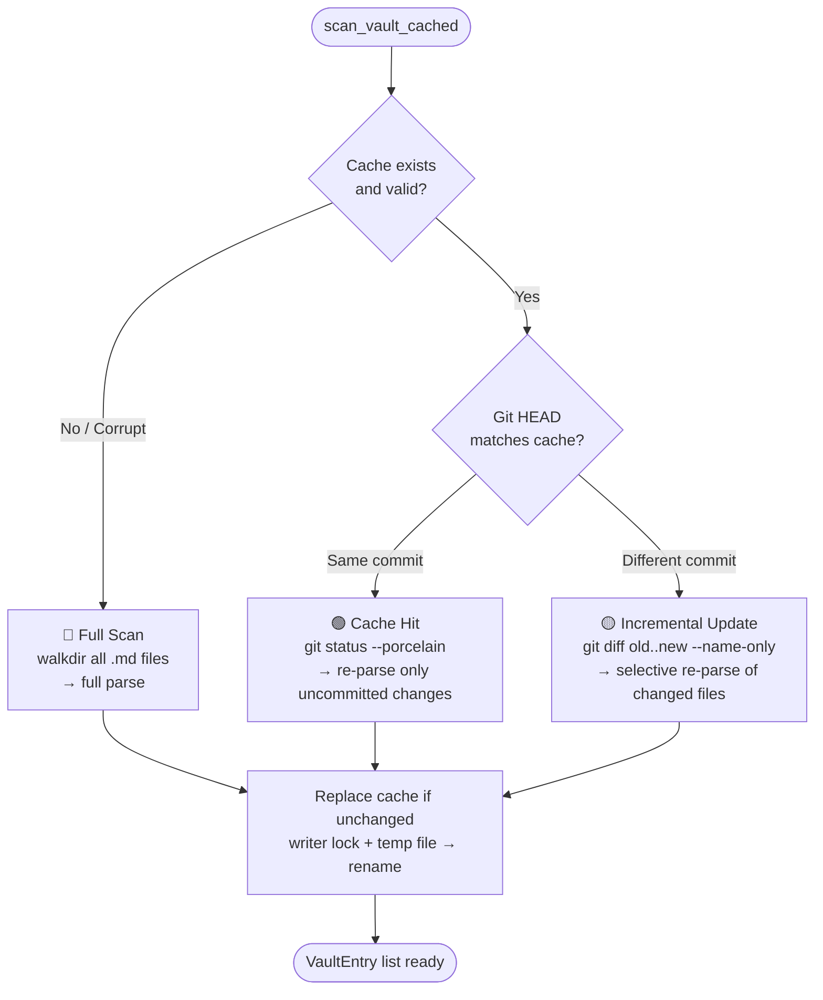
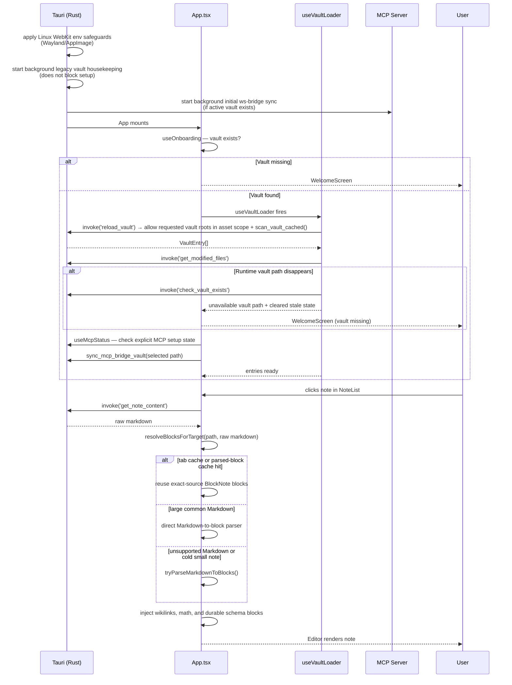
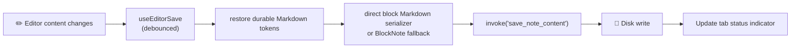
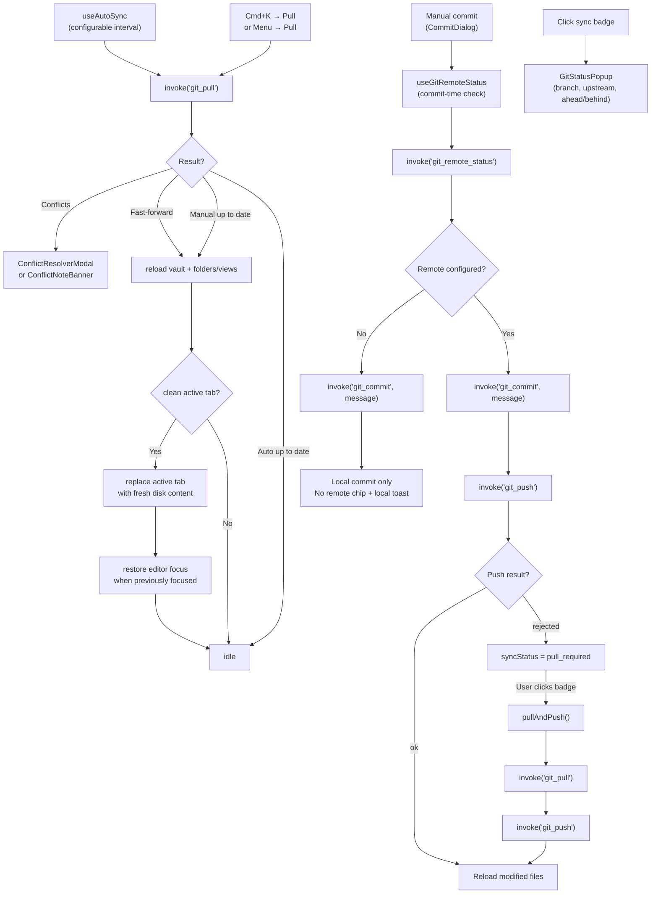
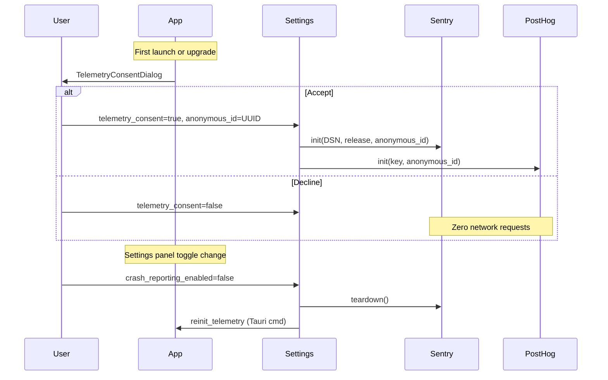

# Architecture

Tolaria is a personal knowledge and life management desktop app. It reads a vault of markdown files with YAML frontmatter and presents them in a four-panel UI inspired by Bear Notes.

## Design Principles

### Filesystem as the single source of truth

The vault is a folder of plain markdown files. The app never owns the data — it only reads and writes files. The cache, React state, and any in-memory representation are always derived from the filesystem and must be reconstructible by deleting them. When in doubt, the file on disk wins.

### Convention over configuration

Tolaria is opinionated. Standard field names (`type:`, `status:`, `url:`, `Workspace:`, `belongs_to:`, `related_to:`, `has:`, `start_date:`, `end_date:`) have well-defined meanings and trigger specific UI behavior — without any setup. Relationship defaults are stored in snake_case on disk and humanized in the UI. This is not convention *instead of* configuration: users can override defaults via config files in their vault (e.g. `config/relations.md`, `config/semantic-properties.md`). But the defaults work out of the box, and most users never need to touch them.

This principle directly serves AI-readability: the more structure comes from shared conventions rather than per-user custom configurations, the easier it is for an AI agent to understand and navigate the vault correctly — without needing bespoke instructions for every setup.

### Where to store state: vault vs. app settings

When deciding where to persist a piece of data, ask: **"Would the user want this to follow them across all their Tolaria installations — other devices, future platforms (tablet, web)?"**

| Follows the vault | Stays with the installation |
|-------------------|-----------------------------|
| Type icon, type color | Editor zoom level |
| Pinned properties per type | API keys (OpenAI, Google) |
| Sidebar label overrides | Auto-sync interval |
| Property display order | Window size / position |
| Per-note `_width` rich-editor width override | Default rich-editor note width |
| Vault-authored `.gitignore` patterns | Whether this installation hides Gitignored files |
| N/A | Whether this installation shows Git features |
| N/A | Git executable provider (`native` vs WSL2 distribution) |
| Per-vault All Notes note-list column overrides | All Notes PDF/image/unsupported file visibility |
| N/A | Per-vault Git setup prompt opt-out |
| Type `_sidebar_label` overrides | Whether this installation auto-pluralizes type labels |
| N/A | Registered workspace labels, aliases, mount state, and default new-note destination |
| Any user-visible customization of how content is organized or displayed | Any machine-specific or credential-type setting |

**Rule:** If the information is about *how the content is structured or presented* and the user would expect it to be consistent wherever they open their vault, store it in the vault (frontmatter of the relevant note, using the `_field` underscore convention for system properties). If it's about *this specific installation of the app*, store it in app config JSON under `$XDG_CONFIG_HOME/com.tolaria.app/` (defaulting to `$HOME/.config/com.tolaria.app/` on Unix platforms), or in localStorage for renderer-only transient layout state.

Examples:
- ✅ Vault: `_pinned_properties` in a Type note (every device should show the same pinned properties)
- ✅ Vault: `_icon: shapes` in a Type note (icon is part of the type's identity)
- ✅ Vault: `_width: wide` in a note that already has frontmatter (per-note reading/editing preference)
- ✅ App settings: `zoom: 1.3` (machine-specific preference)
- ✅ App settings: `ui_language: "zh-CN"` (installation-specific UI language)
- ✅ App settings: `note_width_mode: "wide"` (installation-specific default for notes without an override)
- ✅ App settings: `date_display_format: "friendly"` (installation-specific date rendering preference)
- ✅ App settings: `sidebar_type_pluralization_enabled: false` (installation-specific sidebar label preference)
- ✅ App settings: `all_notes_show_images: true` (installation-specific All Notes file-category visibility)
- ✅ App settings: `git_provider: "wsl"` plus `git_wsl_distro: "Ubuntu"` (machine-specific Git executable location)

### No hardcoded exceptions

No field names, folder paths, or vault-specific values should be hardcoded in the application source code. What can be a convention should be a convention. What needs to be configurable should live in a file. Relationship fields are detected dynamically by checking whether values contain `[[wikilinks]]` — no hardcoded field name lists.

### AI-first knowledge graph

Notes are not just documents — they are nodes in a structured graph of people, projects, events, responsibilities, and ideas. Every design decision should ask: "Does this make the knowledge graph easier for a human *and* an AI to navigate?" Conventions that are legible to both are better than conventions that are legible only to one.

### Three representations, one authority

Vault data exists in three forms simultaneously:
1. **Filesystem** — the `.md` files on disk. This is the single source of truth.
2. **Cache** — `~/.laputa/cache/<hash>.json`, an index for fast startup. Always reconstructible from the filesystem.
3. **React state** — the in-memory `VaultEntry[]` during a session. Always derived from the cache or filesystem.

These must never diverge permanently. If they do, the filesystem wins and the cache/state are rebuilt.



#### Ownership rules

| Layer | Owner | Writes to | Reads from |
|-------|-------|-----------|------------|
| Filesystem | Tauri Rust commands (`save_note_content`, `update_frontmatter`, etc.) | Disk | — |
| Cache | `scan_vault_cached()` in `vault/cache.rs` | `~/.laputa/cache/` | Filesystem + git diff |
| React state | `useVaultLoader` + `useEntryActions` + `useNoteActions` | In-memory `entries` | Cache (on load), filesystem (on reload) |

#### Invariants

1. **Disk-first writes**: All functions that change vault data must write to disk (via Tauri IPC) *before* updating React state. This ensures that if the disk write fails, React state remains consistent with what's actually on disk.
2. **Optimistic UI with rollback**: Where responsiveness matters (e.g. `persistOptimistic` in `useNoteCreation`), state may update before disk confirmation — but a failure callback must revert the optimistic state.
3. **No orphan state updates**: Never call `updateEntry()` before the corresponding `handleUpdateFrontmatter()` or `handleDeleteProperty()` has resolved. Type metadata actions in `useEntryActions` follow this rule — create the missing type document if needed, write frontmatter first, then update state. If missing type creation collides with an existing note filename, the action stops after the existing creation toast instead of applying orphaned state.
4. **Recovery via reload**: If state ever diverges from disk (crash, external edit, race condition), `Reload Vault` (Cmd+K → "Reload Vault") invalidates the cache and does a full filesystem rescan via the `reload_vault` Tauri command, replacing all React state. The `reload_vault_entry` command can re-read a single file.
5. **Cache is disposable**: The `reload_vault` command deletes the cache file before rescanning, guaranteeing fresh data. The cache never contains data that doesn't exist on the filesystem.
6. **Visibility filters are command-boundary concerns**: Gitignored-content visibility is applied after scanning/caching, before entries, folders, or search results reach React. The cache remains complete so toggling the setting can show ignored content again without rebuilding a different cache shape. Large folder filtering runs on the blocking Tokio pool and drains `git check-ignore` output while feeding stdin so broad ignore matches cannot freeze the native UI thread.

#### External Change Detection

The main window starts a native watcher for the active vault through `start_vault_watcher` / `stop_vault_watcher` (`src-tauri/src/vault_watcher.rs`, backed by Rust `notify`). The watcher emits `vault-changed` events for content paths and ignores churn from `.git/`, `node_modules/`, temp files, and `.tolaria-rename-txn`. `useVaultWatcher` batches those events, suppresses recent app-owned saves, and sends the remaining external paths through `refreshPulledVaultState()` so folders, saved views, note-list state, and clean active-editor content refresh under the ADR-0135 unsaved-edit rules. When that clean active-editor remount starts from a focused editor, the main app dispatches a post-replacement editor focus request so typing can continue in the refreshed tab. `useVaultLoader.isReloading` drives the status-bar reload spinner for both manual and watcher-triggered reloads.

#### Progressive Vault Loading

Vault opening is allowed to render the main app shell while the entry index is still in flight. Initial startup hydration uses the cached/incremental `list_vault` path; the main window falls back to `reload_vault` only when that cached startup result is empty, while explicit refresh paths still force a fresh reload. Clean same-commit cache hits reuse stored entry timestamps without running a full `git log` date scan, so warm startup does not scale with the vault's complete history. `useVaultLoader` keeps `isLoading` true until entries are ready, but folders and saved views load independently so the sidebar can become useful before the note index completes. The status bar uses the vault activity badge during this initial indexing state, while command-palette and editor-shell interactions remain mounted instead of being hidden behind the full app skeleton. The full skeleton is reserved for app-level capability checks such as the initial Git-state probe.

Large-vault reproduction and keyboard QA steps live in [LARGE-VAULT-LOADING-QA.md](./LARGE-VAULT-LOADING-QA.md).

#### Mounted Workspaces

The registered vault list can act as a mounted-workspace set. `useVaultSwitcher` persists each workspace's installation-local identity (`label`, stable `alias`, color, mount flag) and the default destination for newly created notes in `vaults.json` under Tolaria's app config directory (`$XDG_CONFIG_HOME/com.tolaria.app/`, defaulting to `$HOME/.config/com.tolaria.app/` on Unix platforms). `useVaultLoader` scans every available mounted workspace and annotates each `VaultEntry` with provenance before React consumes the combined graph. The default workspace is the write target for new notes and Type documents; it is not the only active vault when multiple workspaces are enabled.

Vault item deep links use the registered vault list as their resolver namespace. `src/utils/deepLinks.ts` builds `tolaria://<vault-slug>/<relative-path-with-extension>` URLs from workspace aliases, labels, and paths, appending a short stable hash when generated slugs would collide. `useDeepLinks` validates incoming links, switches vaults when required, reloads the vault index once for recently changed files, and opens the matching `VaultEntry` through the normal note-selection path.

Saved Views participate in that mounted graph as source-scoped chrome. `useVaultLoader` loads view definitions from every mounted vault, annotates each `ViewFile` with its owning `rootPath` and workspace identity, and keeps sidebar selection/persistence keyed by `(rootPath, filename)` so same-named view files from different vaults stay independent.

Git surfaces resolve repository paths explicitly. `useGitRepositories` derives the active repository set from the mounted available workspaces, keeps separate selected repositories for Changes, Pulse/history, and manual commits, and exposes the combined modified-file count for status/commands. Native Git capability checks treat a mounted workspace as Git-backed when it is inside any Git work tree, so included vault folders can reuse a parent repository without creating embedded `.git` directories. Mounted folders outside Git return no changes/no remote for aggregate probes instead of failing workspace-wide sync. AutoGit checkpoints iterate that repository set, while manual commit, history, diff, and discard operations use the selected surface or the note's workspace provenance.

Git command launch is also installation-local. The Rust Git module resolves a `GitLaunchConfig` from app settings before spawning Git, defaulting to native `git` while allowing Windows installations to explicitly select WSL2 Git and a distribution. WSL-selected launches go through `wsl.exe --exec git` and translate Windows/WSL UNC vault paths before passing repository paths across the command boundary; Tolaria never silently switches providers based on detection alone.

Renderer git file workflows stay behind `useGitFileWorkflows`. The hook resolves per-note repository paths, queues editor diff requests, opens Pulse history entries including deleted-file previews, and keeps discard/reload handling close to the selected Git surface while `App.tsx` only wires the resulting callbacks into `NoteList`, `PulseView`, and `Editor`.

Cross-workspace note reads and writes keep the disk-first invariant. When an absolute note path is saved or read without an explicit `vaultPath`, the Tauri boundary resolves the deepest registered vault root that contains the path and validates against that root before touching disk. This lets an editor tab opened from a mounted workspace save back to its source repository while preserving the same path-escape protections as active-vault operations.

#### Note Opening Fast Path

Note opening uses bounded in-memory fast paths for raw content and parsed editor blocks. `useTabManagement` owns the markdown/text prefetch cache and treats every cached value as a performance hint only: identity-matched entries (`modifiedAt` + `fileSize`) can be reused immediately, while identity-missing or identity-mismatched cached text is checked with `validate_note_content`, which compares the cached text with the current file bytes inside the validated vault boundary. If validation fails, Tolaria discards the cached entry and reads fresh disk content before swapping the editor.

The note list opportunistically preloads visible and adjacent markdown/text entries after a short delay. When a large warmed Markdown note resolves, `useEditorTabSwap` may parse it into a bounded parsed-block cache only after foreground editor work has been idle and the rich editor is mounted. On foreground open, block resolution checks the hot tab cache, exact-source parsed-block cache, blank/H1 fast path, and a direct Markdown-to-block parser for large common Markdown before falling back to BlockNote's parser. The direct parser runs in a module worker when available and falls back synchronously only for tests or runtimes without workers. It is conservative: unsupported Markdown constructs return to the BlockNote path rather than changing semantics. Large resolved block sets mount progressively: the editor is locked, the first chunk is applied immediately, remaining chunks append across animation frames, and the same generation/source-content token can abort the partial mount before it is committed. Ordinary BlockNote block wrappers stay fully measurable after mount so hover side menus, slash dialogs, and document-end interactions do not inherit browser lazy-height scroll jumps. Parsed blocks are keyed by vault, path, and exact source content; every async swap carries a generation/source-content token so stale conversion results cannot overwrite newer file content or dirty editor state. The editor never renders a preview surface that later morphs into BlockNote. Development builds log `editorBlockResolve`, `editorBlockApply`, and `parsedBlockPreload` timings for large or slow note opens. See [ADR-0105](./adr/0105-editor-correctness-and-responsiveness-contract.md).

Rich-editor Markdown boundaries stay on the editor fast path while keeping one owner for import, installation, and export. `src/utils/richEditorMarkdown.ts` installs the direct serializer on real BlockNote editors, preprocesses Markdown before parsing, injects Tolaria schema blocks after parsing, and serializes body/document Markdown for saves, raw-mode entry, tab swaps, and position snapshots. Its lower-level direct serializer (`src/utils/blockNoteDirectMarkdown.ts`) serializes common Tolaria block shapes to Markdown with a per-editor weak cache keyed by stable block object identity and list context. Durable Markdown bridges for wikilinks, math, highlights, files, Mermaid, tldraw, and sandboxed HTML stay behind `richEditorMarkdown.ts`; the bridge helpers preserve unchanged block objects so repeated debounced saves can reuse direct Markdown projections. Stable active-tab rerenders trust the exact-source block cache before doing any full-document Markdown comparison, so unrelated React state changes do not serialize large notes. Unsupported block shapes fall back to BlockNote's lossy serializer, and development builds log `richEditorSerialize` timing/cache/fallback metrics plus rare `editorStabilityCheck` fallback comparisons for large or slow serializations.

Rich-editor typing keeps BlockNote's per-transaction work minimal. Tolaria creates BlockNote with animation bookkeeping disabled so the `previousBlockType` extension, which scans the old and new ProseMirror documents on every edit, is not installed. Collapsed-heading rendering attaches its mutation observer and `editor.onChange` subscription only while at least one heading/list section is collapsed, then detaches when the final section expands. Development builds wrap ProseMirror dispatch once per editor view and log `richEditorDispatch` timings for large or slow transactions, giving QA a direct signal for edit-time stutter instead of only note-open speed.

Editor responsiveness is also protected by a synthetic browser benchmark. `pnpm perf:editor` launches an isolated Vite server, injects small and large synthetic Markdown vault entries, opens each note repeatedly, and records medians for editor visibility, first content rendered, full note application, post-open edit frame latency, and development timing logs such as block resolution/application. `.editor-performance-thresholds.json` stores ratcheted local budgets for those medians; `pnpm perf:editor:update` refreshes baselines only when intentionally accepting a new local floor.

## Tech Stack

| Layer | Technology | Version |
|-------|-----------|---------|
| Desktop shell | Tauri v2 | 2.10.0 |
| Frontend | React + TypeScript | React 19, TS 5.9 |
| Editor | BlockNote | 0.46.2 |
| Editor render extensions | @tiptap/pm | ProseMirror decorations for rich-editor node presentation |
| Code block highlighting | @blocknote/code-block | 0.46.2 |
| Additional code grammars | @shikijs/langs | 3.23.0 |
| Diagram rendering | Mermaid | 11.14.0 |
| Whiteboard rendering | tldraw | 4.5.10 |
| Raw editor | CodeMirror 6 + official language packages | Markdown, fenced HTML, YAML, JSON, Python, SQL, JS/TS |
| Spreadsheet editor | IronCalc workbook + WASM | 0.5.x |
| Styling | Tailwind CSS v4 + CSS variables | 4.1.18 |
| UI primitives | Radix UI + shadcn/ui | - |
| Icons | Phosphor Icons | - |
| Build | Vite | 7.3.1 |
| Backend language | Rust (edition 2021) | 1.77.2 |
| Frontmatter parsing | gray_matter | 0.2 |
| Filesystem watcher | notify | 6.1 |
| AI (workspace) | CLI agent adapters (Claude Code + Codex + GitHub Copilot + OpenCode + Pi + Antigravity + Kiro + Hermes Agent) plus configured local/API model targets | - |
| Search | Keyword (walkdir-based file scan) | - |
| Localization | App-owned runtime + JSON catalogs (`src/lib/i18n.ts`, `src/lib/locales/*.json`, `lara.yaml`) | English fallback + Lara CLI sync |
| MCP | @modelcontextprotocol/sdk | 1.0 |
| Tests | Vitest (unit), Playwright (E2E/smoke), cargo test (Rust) | - |
| Package manager | pnpm | - |

## System Overview



## Four-Panel Layout

```
┌────────┬─────────────┬─────────────────────────┬────────────┐
│Sidebar │ Note List   │ Editor                  │ Right Panel│
│(250px) │ (300px)     │ (flex-1)                │ (280px)    │
│        │ OR          │                         │ OR         │
│ All    │ Pulse View  │ [Breadcrumb Bar]        │ TOC        │
│ Changes│             │                         │ OR         │
│ Pulse  │ [Search]    │ # My Note               │ Properties │
│ Inbox  │ [Sort/Filt] │                         │            │
│        │             │                         │ Context    │
│Projects│ Note 1      │ Content here...         │ Messages   │
│Experim.│ Note 2      │ (BlockNote or Raw)      │ Actions    │
│Respons.│ Note 3      │                         │ Input      │
│People  │ ...         │                         │            │
│Events  │             │                         │            │
│Topics  │             │                         │            │
├────────┴─────────────┴─────────────────────────┴────────────┤
│ StatusBar: v0.4.2 │ main │ Synced 2m ago │ Vault: ~/Laputa │
└──────────────────────────────────────────────────────────────┘
```

- **Sidebar** (220-400px, resizable): Top-level filters (All Notes, Changes, Pulse), saved Views, collapsible type-based section groups, and a dedicated folder tree. The folder tree starts with a vault-root row labeled from the opened vault path, shows root-level files when selected, and nests user-created folders plus default vault folders such as `attachments/` and `views/` underneath it; only the dedicated `type/` directory stays hidden because note types already have their own sidebar section. Saved Views persist a top-level YAML `order` field in each view file and use the same ordered-list mental model as Types for single-vault lists: pointer users can drag the existing view row, double-click to rename it, or right-click for edit/rename/appearance/delete actions, while keyboard users can use the row context key for the same menu and command-palette move actions for ordering. In multiple-vault mode, saved View rows are keyed by source vault plus filename so duplicate filenames do not collide, and edits/deletes route to the owning vault. The folder tree supports inline folder creation and rename, exposes a right-click menu for rename/delete plus filesystem reveal/copy-path actions on mutable folders, and auto-expands ancestor folders when the current selection or rename target is nested. Folder creation sends the selected folder's vault-relative path and mounted root to `create_vault_folder`, so a new folder is created under the focused parent instead of defaulting to the active vault root. Type sections and folder rows also act as note drop targets: dropping a note on a type updates its `type:` frontmatter, while dropping it on a folder runs the same crash-safe move path as the command palette flow. Each type can have a custom icon, color, sort, and visibility set via its `type: Type` document; new type documents created by Tolaria are written at the vault root. In mounted multi-vault graphs, duplicate type names still render as one sidebar section, but the visibility picker becomes a workspace matrix and writes visibility to the specific vault's Type document, so hidden type definitions suppress only notes of that type from the same workspace.
- **Note List / Pulse View** (220-500px, resizable): When a section group, filter, folder, saved view, or Neighborhood selection is active, the renderer first adapts that navigation state into a Collection (`src/collections/collectionFromSelection.ts`) and then resolves visible entries or relationship groups through `src/collections/resolveCollectionEntries.ts`. The only active collection presentation is currently `list`, so the pane still shows filtered notes with snippets, modified dates, status indicators, and per-context note-list controls. When `selection.kind === 'entity'`, the same pane enters **Neighborhood** mode: the source note is pinned at the top as a normal active row, outgoing relationship groups render first, inverse/backlink groups follow, empty groups stay visible with `0`, and duplicates across groups are allowed when multiple relationships are true. Plain click / `Enter` open the focused note without replacing the current Neighborhood, while Cmd/Ctrl-click and Cmd/Ctrl-`Enter` pivot the pane into the clicked note's Neighborhood. Inbox organization auto-advance is coordinated by `useInboxOrganizeAdvance`, which only opens the next visible Inbox note when the organized note is still the active requested tab after the write finishes. Folder-backed lists also show non-Markdown files: previewable media and PDF binaries get file indicators and open in the editor pane, while unsupported binaries remain muted instead of auto-launching an external app. Saved views reuse the same sort and visible-column controls as the built-in lists, and those changes persist back into the view `.yml` definition (`sort`, `listPropertiesDisplay`). The renderer normalizes those legacy list fields into `presentation: { type: "list" }` in memory so future saved-view presentation settings can share the same collection model without changing existing YAML. When Pulse filter is active, shows `PulseView` — a chronological git activity feed grouped by day. On macOS, collapsed note-list/Pulse headers and the editor-only breadcrumb read the shared `--tolaria-macos-traffic-light-padding` CSS variable so native fullscreen can remove traffic-light whitespace without remounting the panes.
- **Editor** (flex, fills remaining space): Single note open at a time (no tabs — see ADR-0003). Breadcrumb bar with filename controls, read-only legacy display-title context when a no-H1 note's title differs from its filename, word count, rich-editor width toggle, and the secondary-overflow Table of Contents action, BlockNote rich text editor with wikilink support, Markdown-compatible inline/display math rendering, first-class Mermaid diagram blocks, sandboxed fenced HTML blocks, markdown-safe formatting controls, and schema-backed fenced code block highlighting via `@blocknote/code-block` plus lazy direct `@shikijs/langs` registrations for missing common grammars. Sandboxed HTML blocks resolve renderer-owned `{{...}}` vault expressions against current-note properties, external note scalar properties, single sheet cells, raw body-line references, and `json(...)` structured-data helpers before the existing sanitizer/iframe boundary. Scripts are blocked unless the fence explicitly declares `scripts="sandboxed"`, which grants only opaque-origin inline script execution while keeping same-origin, network, workers, forms, nested frames, parent DOM access, Tauri IPC, and top navigation unavailable. Can toggle to diff view (modified files), raw CodeMirror view, or a wide rich-editor reading surface with preserved side margins; raw CodeMirror remains full-width and unaffected by note width mode. Raw CodeMirror chooses syntax highlighting from the file extension for Markdown, YAML, JSON, Python, SQL, JavaScript, and TypeScript files, highlights HTML inside fenced `html` blocks, and keeps unknown text files plain. Inline rich-editor images open in a localized shadcn lightbox on double-click while normal single-click BlockNote selection remains untouched, and tiny tracking-style images are ignored. Binary image, audio, video, and PDF files render through `FilePreview` as ordinary vault files using Tauri asset URLs; editor-embedded audio and video use the same scoped asset sources through the CSP `media-src` allow-list, while packaged PDF previews require scoped asset sources in both `object-src` and `frame-src` because the webview PDF renderer uses a nested frame context. Linux AppImage builds ask the native runtime whether audio/video should fall back to external-open controls before mounting webview media elements. External-open actions call `open_vault_file_external` so the target is validated against the active vault before the native default app opens it. Unsupported/broken binaries show explicit fallback states and keyboard focus returns to the note list on `Escape`. Decomposed into `Editor` (orchestrator), `EditorContent`, `FilePreview`, `EditorRightPanel`, `TableOfContentsPanel`, `SingleEditorView`, with hooks `useDiffMode`, `useEditorFocus`, and `useEditorSave`, plus the `useRawMode`/`RawEditorView` pair for raw source editing. Rich BlockNote input and raw CodeMirror input both route typed `->`, `<-`, and `<->` through the shared `src/utils/arrowLigatures.ts` resolver so arrow ligatures stay consistent across mode switches while escaped ASCII sequences remain literal. Rich-editor Markdown input transforms for arrows, inline math, and `==highlight==` share one capture-phase `beforeinput` execution path in `src/components/richEditorInputTransform.ts` and are composed by `src/components/richEditorInputTransformExtension.ts`. Navigation history (Cmd+[/]) replaces tabs.
  Rich code blocks wrap long lines, render a derived non-editable line-number gutter, scope Cmd/Ctrl+A to their source, and support Enter-after-fence plus Cmd/Ctrl+Shift+Backquote creation paths through `richEditorCodeBlockShortcutExtension.ts`.
  Rich-editor Markdown input/output is routed through `src/utils/richEditorMarkdown.ts`, which owns parser preprocessing, schema-block injection, direct serializer installation, durable-token restoration, raw-mode/tab-swap serialization, and fallback to BlockNote's Markdown exporter for unsupported shapes.
  Rich-editor copy uses BlockNote's external HTML serializer for selected note content so tables, lists, checklists, and inline formatting paste richly into other apps, with Tolaria keeping fenced-code selections as raw code text and normalized plain text on the clipboard.
  Rich-editor block selection keeps ProseMirror plugin state, decorations, and key dispatch in `src/components/richEditorBlockSelectionExtension.ts`, while document traversal/collapsed-content operation IDs live in `src/components/richEditorBlockSelectionDocument.ts` and block clipboard serialization/parsing lives in `src/components/richEditorBlockSelectionClipboard.ts`.
  Tolaria's BlockNote side menu keeps UI composition in `tolariaBlockNoteSideMenu.tsx`, while collapsed-section rendering and ellipsis hit-testing live in `tolariaCollapsedSections.ts`, pointer block reordering lives in `tolariaBlockReorder.ts`, measured side-menu positioning lives in `tolariaSideMenuAlignment.ts`, and stale-block lookup helpers live in `tolariaSideMenuBlocks.ts`.
  Note PDF export stays renderer-owned for layout: `useEditorPdfExport` exits diff/raw views, applies a print-only stylesheet to the rendered note root, and checks the native PDF capability before choosing a platform path. On macOS, the renderer asks for a filesystem PDF destination before the Tauri `export_current_webview_pdf` command saves the current `WKWebView` print operation directly; on Windows/Linux Tauri builds and in browser mode, the same export action falls back to the native/browser print dialog. The export reuses rendered BlockNote output so frontmatter is omitted, while math, images, Mermaid diagrams, tldraw blocks, code, tables, and links degrade through their existing DOM rather than a second Markdown-to-PDF renderer, and the source Markdown is never modified. Markdown notes expose the same export action from Cmd+K, the native Note menu, the breadcrumb overflow menu, and each Markdown row's note-list context menu.
- **Right side panels** (200-500px or hidden): Properties and Table of Contents are mutually exclusive panels mounted by `EditorRightPanel` and coordinated by `useRightPanelExclusion`. Properties shows frontmatter, relationships, instances, backlinks, and git history; Table of Contents is lazy-mounted only while open, derives a title-rooted H1/H2/H3 hierarchy through a debounced Web Worker per ADR-0109, and reuses folder-tree indentation/guide geometry with heading icons while resolving live BlockNote block IDs at click time for navigation. The breadcrumb bar toggles Table of Contents and Properties actions. Per-note `icon` is a suggested Properties field and the command palette's "Set Note Icon" action opens that field directly. When viewing a Type note, Properties shows an **Instances** section listing all notes of that type (sorted by modified_at desc, capped at 50).

- **AI workspace** (docked panel or native window): `AiWorkspace` owns the multi-chat orchestration, sidebar tabs, installed-only target picker, permission-mode picker, and dock/pop-out controls. Header/guidance chrome lives in `AiWorkspaceChrome`, edge-resize handles in `AiWorkspaceResizeHandles`, conversation metadata/settings persistence in `aiWorkspaceConversations`, and sizing/class/style helpers in `aiWorkspaceSizing`. The status-bar AI affordance opens this workspace instead of changing the default target inline. Docked workspace mode renders as a compact bounded desktop tool inside the main app; users resize the anchored panel from its left/top edges and resize the chat-list sidebar separately from the transcript area. Pop-out mode opens a dedicated undecorated transparent Tauri webview window labeled `ai-workspace` and boots the lightweight `AiWorkspaceWindowApp` route instead of the full vault shell. The chat header and sidebar header are draggable in native-window mode; closing the pop-out only closes that window, while the dock control emits a dock request back to the main window before closing the pop-out. Chat sessions reuse `AiPanelView` for transcript/composer rendering with the old panel header disabled; target and permission controls live in the composer toolbar so there is one workspace header per active chat. AI workspace cross-window localStorage, BroadcastChannel, storage-event, and subscriber-set plumbing is owned by `createCrossWindowPersistedStore`; domain stores keep only sanitization, mutation, and native persistence behavior.

Panels are separated by `ResizeHandle` components that support drag-to-resize. `useLayoutPanels` clamps the sidebar, note-list, and inspector widths before applying them, keeps the side panes from flex-shrinking below their protected widths, and persists the last chosen widths in installation-local localStorage under `tolaria:layout-panels`. The main window also restores the Properties panel's last open/closed state from `tolaria:right-panel-collapsed`; auxiliary note windows keep their collapsed override without replacing that main-window preference.

The main Tauri window derives its minimum width from the visible panes instead of a single fixed floor. `useMainWindowSizeConstraints` treats the editor-only shell as the 480px baseline, adds the current sidebar / note-list / expanded-inspector widths on top with minimum floors, and calls the native `update_current_window_min_size` command whenever view mode, inspector visibility, or restored pane widths change. That same native command can grow the current window back out when a wider pane combination is restored, but Windows keeps grow-to-fit disabled and skips min-size mutation while fullscreen or maximized so navigation/sidebar interactions do not unfullscreen or reposition the main window. Note windows skip this path and keep their dedicated 800×700 initial sizing.

The main Tauri window also persists its last normal size and screen position in the app config directory as `window-state.json`. The state stores logical window points, while `window_state.rs` migrates older physical-pixel state on read so Retina and non-Retina launches restore the same user-facing bounds. On startup, the restored frame applies only to the main window and clamps to the currently available monitor work areas, so stale coordinates from a disconnected display fall back to a visible placement. Maximized, fullscreen, minimized, and detached note-window frames are not written as the restore baseline.

Tauri setup keeps launch-time filesystem and subprocess work off the window creation critical path. Legacy `~/Laputa` housekeeping and the initial persisted-vault MCP bridge sync run on named background threads, so large legacy vaults, stale active-vault paths, or slow process startup cannot beachball the macOS app before React mounts. React still resyncs the bridge from `useVaultSwitcher` after the persisted selection loads, and no selected vault stops the bridge. AI-agent CLI availability probing is also off the first-paint path: the renderer defers `get_ai_agents_status` until an idle/timeout tick, skips it for disabled AI surfaces and secondary windows, falls back to missing-agent onboarding state if the status IPC does not settle promptly, and the Rust command fans per-agent CLI checks across Tokio's blocking pool with per-agent timeouts. The HTML bootstrap ships a static, non-interactive app-shell skeleton inside `#root` so the WebView paints Tolaria chrome before the React module graph and lazy app route finish loading. It also installs a Tauri-only one-shot watchdog: React reports readiness from an effect after the root commits, and if that readiness signal never arrives the WebView reloads once instead of leaving macOS users in an inert rendered shell.

Desktop startup registers `tauri-plugin-deep-link` and `tauri-plugin-single-instance` before setup so `tolaria://` links can focus the existing main window and deliver URL events to the renderer. `tauri.conf.json` declares the `tolaria` scheme for bundled desktop builds; Windows and Linux also run `register_all()` as a runtime repair path, while macOS relies on bundle registration.

Linux and Windows use custom React-rendered window chrome instead of the native Tauri menu bar. `setup_custom_window_chrome()` drops server-side decorations on the main window, `openNoteInNewWindow()` does the same for detached note windows, and `LinuxTitlebar`/`LinuxMenuButton` route both window controls and menu actions back through the same shared command pipeline that the desktop native menus use. The native app menu is macOS-only so Services/Hide/Quit and the reserved `WINDOW_SUBMENU_ID` keep behaving like normal NSApp menu items, while cross-platform custom items such as Check for Updates emit Tolaria command IDs with visible updater feedback from the renderer menu.
On Linux, `run()` applies WebKitGTK startup safeguards before Tauri creates the webview. Native Wayland launches and AppImage launches inject `WEBKIT_DISABLE_DMABUF_RENDERER=1` and `WEBKIT_DISABLE_COMPOSITING_MODE=1` independently unless the user already set either variable, covering compositor-specific WebKit crashes without changing native X11 launches. AppImage launches keep the additional AppImage-only safeguards: on Wayland sessions Tolaria re-execs once with the first architecture-matching system `libwayland-client.so` in `LD_PRELOAD` when the user has not provided their own preload. The candidate order prefers Fedora-style `lib64` and Debian-style `x86_64-linux-gnu` paths before generic `/usr/lib`, and the ELF header is checked so a 64-bit Tolaria process does not retry with a 32-bit Wayland client library. Runtime startup writes a mount-path-specific `GTK_IM_MODULE_FILE` cache when fcitx is configured via `GTK_IM_MODULE=fcitx` or common fcitx environment hints; release packaging currently uses Tauri's stock linuxdeploy AppImage output plugin instead of Tolaria's experimental output-plugin shim. If the user has not already chosen `GTK_IM_MODULE`, Tolaria sets `GTK_IM_MODULE=fcitx` before WebKit starts. The same AppImage path checks whether `fc-match` resolves the default emoji font to `Noto-COLRv1.ttf`; when the user has not provided `FONTCONFIG_FILE` or `FONTCONFIG_PATH`, Tolaria writes a cache-local fontconfig file that rejects only that matched font file and exports it before WebKit starts. The rendering overrides keep WebViews from blanking or crashing after accelerated compositing/DMA-BUF failures, the re-exec addresses AppImage library-order failures that can surface as `Could not create default EGL display: EGL_BAD_PARAMETER`, and the fontconfig guard avoids known WebKit crashes in COLRv1 emoji font rendering while leaving other emoji fonts available.

## Multi-Window (Note Windows)

Notes can be opened in separate Tauri windows for focused editing. Secondary windows boot the same `App` shell and load the same active workspace graph as the main window, but they start in the editor-only view mode with side panels collapsed.

The AI workspace can also open in a separate Tauri window through `openAiWorkspaceWindow()`. That window uses `?window=ai-workspace` to boot the lightweight `AiWorkspaceWindowApp` route, receives the active vault context through URL params, opts out of main-window size constraints and startup AI onboarding, and redocks by emitting `tolaria:ai-workspace-dock-requested` to the main window. Its webview is transparent so the rounded workspace shell defines the visible floating-window corners across desktop platforms.

**Triggers:**
- `Cmd+Shift+Click` on any note in the note list or sidebar
- `Cmd+K` → "Open in New Window" (command palette, requires active note)
- `Cmd+Shift+O` keyboard shortcut
- Note → "Open in New Window" menu bar item

**Architecture:**
- `openNoteInNewWindow()` (`src/utils/openNoteWindow.ts`) creates a new `WebviewWindow` via the Tauri v2 JS API with URL query params (`?window=note&path=...&vault=...&title=...`)
- `main.tsx` always mounts `App`; `App` checks `isNoteWindow()` at startup, keeps normal vault/workspace loading active, and `useNoteWindowLifecycle` opens the requested note after the app graph is ready
- Each window has its own auto-save via `useEditorSaveWithLinks` (same 1.5s low-end-safe idle debounce, same Rust `save_note_content` command), and raw-editor typing also derives frontmatter-backed `VaultEntry` state in the renderer so Inspector and note-list surfaces react immediately without waiting for a full reload
- Secondary windows are sized 800×700; macOS keeps the overlay title bar, while Linux mounts the shared React titlebar on undecorated windows
- Capabilities config (`src-tauri/capabilities/default.json`) grants permissions to both `main` and `note-*` window labels

## AI System

### AI Agent (AiPanel)

Full agent mode — spawns the selected local CLI agent as a subprocess with tool access and MCP vault integration.

1. **Frontend** (`AiPanel` + `useCliAiAgent` + `aiAgentSession.ts` + `aiAgents.ts` + `aiTargets.ts`) — one normalized session lifecycle for message state, reasoning blocks, tool action cards, response display, onboarding, default-target selection, bundled-docs prompt injection, and the per-vault Safe / Power User permission mode shown in the panel header for coding agents
2. **Backend orchestration** (`ai_agents.rs`) — normalizes agent availability, streaming, and the request permission mode before dispatching to per-agent adapters
3. **Shared runtime scaffold** (`cli_agent_runtime.rs` and submodules) — owns the common request shape, prompt wrapping, JSON-line and line-oriented subprocess lifecycle, stdout/stderr/stdin plumbing, normalized error/done handling, version probing, Tolaria stdio MCP server entry generation, and MCP server path resolution used by app-managed CLI agents
4. **Agent adapters** — Shared prompts are mode-aware on every turn, including turns with note context snapshots: Vault Safe tells agents not to use or advertise shell, while Power User tells shell-capable agents to keep local commands scoped to the active vault. Claude Code still uses `claude_cli.rs` with `acceptEdits`, strict Tolaria MCP config, and a scoped tool list: Safe enables file/search/edit tools only, while Power User adds Bash to the available tools and pre-approves Bash with `--allowedTools` without using dangerous permission-bypass flags. Codex runtime specifics live in `codex_cli.rs`; Safe runs `codex --sandbox read-only --ask-for-approval untrusted exec --json`, while Power User runs `codex --sandbox workspace-write --ask-for-approval never exec --json` so shell execution stays enabled across repeated turns. GitHub Copilot runs through `copilot -p <prompt> -s --no-ask-user` from the active vault, streams line-oriented stdout, passes Tolaria MCP through `--additional-mcp-config`, uses Safe mode with only write and Tolaria MCP tools preapproved, and maps Power User to `--allow-all-tools` without `--allow-all`, `--yolo`, or global path/URL bypasses. OpenCode runs through `opencode run --format json` with transient permissions: Safe denies bash and external directories, while Power User allows bash but still denies external directories. Pi runs through `pi --mode json --no-session` with `npm:pi-mcp-adapter`; both modes currently share the same transient MCP config and the prompt does not promise shell for Pi Power User. Antigravity runs through `agy -p <prompt> --add-dir <vault>`, streams line-oriented stdout, and writes Tolaria MCP into the active vault's `.agents/mcp_config.json`; Safe uses the boolean `--sandbox` flag, while Power User uses `--dangerously-skip-permissions` because current Antigravity CLI builds no longer define `--toolPermission` or accept `--sandbox=<value>`. Kiro runs through `kiro-cli chat --no-interactive --trust-all-tools`, streams line-oriented stdout, drains stderr concurrently, and writes prompt content through stdin to avoid OS argument length limits. Hermes Agent runs through `hermes chat --quiet --source tolaria -q`, streams line-oriented stdout, and uses the user's existing Hermes profile/configuration without mutating `~/.hermes/config.yaml`; setup errors point users to `hermes setup`, `hermes model`, and `hermes doctor`. Codex, GitHub Copilot, OpenCode, Pi, Antigravity, Kiro, and Hermes all launch from the active vault cwd; Codex, GitHub Copilot, OpenCode, Pi, Antigravity, and Kiro receive transient Tolaria MCP config. Pi seeds its transient agent directory from the user's Pi agent directory before merging Tolaria MCP, so app-managed runs keep standalone Pi provider/auth settings. All app-launched paths use hidden Windows launches; dangerous permission-bypass flags remain avoided except for Antigravity Power User, whose CLI exposes that bypass for non-sandboxed autonomy (ADR-0159).
5. **MCP Integration** — Claude receives the generated MCP config file path, Codex receives the same Tolaria MCP server via transient `-c mcp_servers.tolaria.*` config overrides using Tolaria's resolved Node path plus `VAULT_PATH` and `WS_UI_PORT`, GitHub Copilot receives an inline session MCP config through `--additional-mcp-config`, OpenCode receives it through `OPENCODE_CONFIG_CONTENT`, Pi receives it through a temporary `PI_CODING_AGENT_DIR/mcp.json` consumed by `pi-mcp-adapter` after copying and merging the user's Pi agent config, Antigravity receives it through `.agents/mcp_config.json` in the active vault, and Kiro receives it through `.kiro/settings/mcp.json` in the active vault. Hermes uses the user's own Hermes MCP/profile configuration; Tolaria does not rewrite third-party Hermes config files.

Each `stream_ai_agent` call also receives a request-scoped `ai-agent-stream-*` event name. Desktop runs bind that scoped name to any spawned CLI child through `ai_agent_processes.rs`, and `abort_ai_agent_stream` validates the same scoped name before killing the registered child. Renderer stop controls therefore cancel the local subprocess instead of only ignoring stale events, while natural completion and repeated stop requests remain no-ops.

CLI-agent availability intentionally does not depend only on the desktop app's inherited `PATH`. The detectors check the current process path, the user's login shell, and supported local/toolchain install locations such as native `~/.local/bin`, local `~/.claude/local`, Mise/asdf shims, nvm-managed Node installs, npm-global, Homebrew, Windows `%APPDATA%\npm`/pnpm/Scoop shims, Windows `.exe` launchers, and the macOS Codex app resource path so first-run onboarding works on fresh macOS and Windows installs. App-managed CLI spawns also expand the active vault path before using it as the subprocess working directory, then extend the child process `PATH` with the resolved binary directory plus those common toolchain directories, which lets GUI-launched macOS sessions run Homebrew/npm shims and their `node`-backed MCP subprocesses even when Finder/Dock did not inherit a terminal shell path. Claude Code launches copy a narrow set of exported provider/auth environment variables from the app process or the user's zsh/bash startup files, including Anthropic API/base URL values. OpenCode launches do the same for common provider variables and any `{env:NAME}` placeholders found in OpenCode config files, so company proxy and API-key setups that work in Terminal also work when Tolaria is opened from Finder or Dock. Windows npm and Volta `.cmd` shims are not spawned directly; the shared CLI runtime resolves npm shims to their quoted Node script or native executable target and routes Volta shims through `volta run <tool>` so prompt arguments do not hit batch-file argument validation.

CLI-agent system prompts also include a local Tolaria docs orientation when the bundled docs resource is present. `scripts/build-agent-docs.mjs` generates `src-tauri/resources/agent-docs/` from the public VitePress Markdown sources, including `index.md`, `AGENTS.md`, per-section bundles, `all.md`, `search-index.json`, and generated per-page files. Tauri bundles that folder as `agent-docs/`; `get_agent_docs_path` resolves the installed resource path, with a repository fallback for development, and `getAgentDocsPath()` caches it before each agent run. Agents are instructed to read the active vault's `AGENTS.md` for local conventions and search the bundled docs for Tolaria product behavior.

Renderer-facing CLI setup errors can carry a `tolaria:i18n-error:` JSON marker with a translation key and primitive interpolation values. `localizedStreamError.ts` resolves that marker through the active app locale before the AI panel appends stream failure text, so native adapters such as Pi can keep CLI diagnostics in Rust while user-facing setup copy remains in the JSON catalogs.

#### Agent Event Flow



#### File Operation Detection

When the agent writes or edits vault files, `aiAgentFileOperations.ts` detects this from normalized tool inputs and calls `onFileCreated` or `onFileModified` callbacks to trigger vault reload. Unrecognized write-like operations fall back to a full vault refresh.

### Context Building

The agent panel (`ai-context.ts`) builds a structured JSON snapshot from the active note and linked entries:

```json
{
  "activeNote": { "path", "title", "type", "frontmatter", "body", "wordCount", "bodyTruncated?" },
  "openTabs": [{ "path", "title", "type", "frontmatter" }],
  "noteList": [{ "path", "title", "type" }],
  "vault": { "types", "totalNotes" },
  "referencedNotes": [{ "title", "path", "type" }]
}
```

Large active notes are compacted into a head/tail body snapshot before they enter the CLI prompt. The snapshot records `bodyTruncated` metadata and instructs agents to call `get_note(path)` before content-sensitive edits or summaries, keeping lower-context OpenCode providers from failing on oversized active-note context while preserving access to the full note through MCP.

### Direct Model Targets

Tolaria also supports direct model targets for local servers and API providers. These targets are stored as app-level provider metadata and can be selected in Settings or the status bar alongside coding agents. `src/shared/aiModelProviderCatalog.json` is the shared source for provider defaults, local/API grouping, API-key environment placeholders, and runtime fallback base URLs; the renderer imports it through `aiTargets.ts`, and Tauri includes the same JSON in `ai_models.rs`. Direct model targets run in Chat mode: they receive the same note-context snapshot and conversation history, but they do not receive shell access. OpenAI-compatible direct targets can use Tolaria's narrow native `create_note` tool when an active vault is loaded; the tool calls the same create-only, active-vault-bounded note write command as the UI and emits tool events so the renderer refreshes and opens the created note. The backend `stream_ai_model` command supports OpenAI-compatible chat completions and Anthropic Messages-compatible calls, including Ollama, LM Studio, OpenRouter, OpenAI, Anthropic, Gemini, and custom compatible endpoints.

Provider secrets are not written to `settings.json`. Hosted API targets can use Tolaria's local app-data secrets file (`ai-provider-secrets.json`, outside vaults/worktrees and owner-only on Unix) or reference an environment variable name. Env-backed provider keys are resolved from the app process first, then from exported values in the user's zsh/bash startup files on Unix so GUI-launched sessions can still use shell-managed secrets. Local endpoints can omit authentication.

### Authentication

Each CLI agent authenticates itself outside Tolaria. Claude Code uses its existing CLI login or user-managed Anthropic/provider environment variables; Codex surfaces a friendly prompt to run `codex login` when needed; GitHub Copilot surfaces a friendly prompt to run `copilot login`, open `copilot` in the vault, and trust the directory when needed; OpenCode surfaces a friendly prompt to run `opencode auth login` or configure a provider when needed; Pi surfaces a friendly prompt to run `pi /login` or configure a provider API key when needed. Tolaria does not store model-provider API keys in app settings; direct provider secrets stay in local app data or user-managed environment variables. App-managed Pi sessions copy that local Pi agent config into a per-run temporary directory before adding Tolaria MCP, so Tolaria does not overwrite global Pi files and does not drop a working standalone Pi setup.

## MCP Server

The MCP server (`mcp-server/`) exposes vault operations as tools for AI assistants (Claude Code, Antigravity CLI, Cursor, or any MCP-compatible client).
The stdio entrypoint and desktop WebSocket bridge share `mcp-server/tool-service.js` for mounted-vault resolution, note lookup/search, note creation defaults, vault listing, and UI action intents; `index.js` and `ws-bridge.js` only adapt those semantics to their transport-specific request and response shapes.

### Tool Surface

| Tool | Params | Description |
|------|--------|-------------|
| `search_notes` | `query, [limit]` | Search notes by title or content substring |
| `vault_context` / `get_vault_context` | `[vaultPath]` | Get mounted-vault summary: entity types, folders, recent notes, and root `AGENTS.md` instructions |
| `list_vaults` | - | List active mounted vaults and whether each has root `AGENTS.md` instructions |
| `get_note` / `read_note` | `path, [vaultPath]` | Read parsed frontmatter, markdown body content, and `mtimeMs` for conflict-guarded edits |
| `create_note` | `path, content, [title], [type], [vaultPath]` | Create a new markdown note inside an active vault without overwriting existing files |
| `update_note` | `path, content, [expectedMtime], [vaultPath]` | Replace an existing note's full markdown content, optionally failing if `mtimeMs` changed since `get_note` |
| `append_to_note` | `path, content, [vaultPath]` | Append markdown verbatim to the end of an existing note |
| `open_note` / `ui_open_tab` | `path, [vaultPath]` | Open a note in a new Tolaria UI tab |
| `ui_open_note` | `path, [vaultPath]` | Open a note in the Tolaria UI editor |
| `highlight_editor` / `ui_highlight` | `element, [path]` | Highlight a UI element (editor, tab, properties, notelist) |
| `ui_set_filter` | `type` | Set the sidebar filter to a specific type |
| `refresh_vault` | `[path], [vaultPath]` | Trigger a vault rescan after a file change |

### Transports

- **stdio** — standard MCP transport for Claude Code / Cursor (`node mcp-server/index.js`)
- **WebSocket** — live bridge for Tolaria app integration:
  - Port **9710**: Tool bridge — AI/Claude clients call vault tools here
  - Port **9711**: UI bridge — Frontend listens for UI action broadcasts from MCP tools

### Explicit External Tool Setup

Tolaria can register itself as an MCP server in:
- `~/.claude.json` and `~/.claude/mcp.json` (Claude Code compatibility across current CLI and legacy MCP-file setups)
- `~/.gemini/config/mcp_config.json` (Antigravity CLI)
- `~/.cursor/mcp.json` (Cursor)
- `~/.config/mcp/mcp.json` (generic MCP-compatible clients)
- `~/.config/opencode/opencode.json` (OpenCode, using its `mcp` config key)

That setup is user-initiated through the status bar / command palette flow, not a startup side effect. Registration is non-destructive (additive, preserves other servers and Antigravity/OpenCode settings), uses `upsert` semantics, and can be reversed by removing Tolaria's entry again. Tolaria resolves an MCP runtime (Node.js 18+ preferred, Bun 1+ as fallback) before writing config so external clients are not left pointing at a missing binary, writes a vault-neutral `type: "stdio"` entry for standard MCP clients, writes OpenCode's vault-neutral `type: "local"` entry, and sets `WS_UI_PORT=9711` so UI actions route back to the desktop app. Durable and transient client-facing MCP entries convert Windows `mcp-server/index.js` paths from Rust's extended-length `\\?\` spelling back to normal drive or UNC spelling before passing the script argument to Node. Durable external MCP processes resolve active workspaces at tool-call time: explicit `VAULT_PATH`/`VAULT_PATHS` env still wins for app-owned and legacy launches, otherwise the MCP server reads Tolaria's `vaults.json`, uses `active_vault` first, and includes every workspace not marked `mounted: false`. Vault context checks each active workspace root for `AGENTS.md` and includes those instructions in the returned context. The generated standard entry is exposed as an `mcpServers` manual JSON snippet, while OpenCode gets a separate top-level `mcp` snippet with a `command` array through `get_opencode_mcp_config_snippet`; both appear in the MCP setup dialog and copy through the native clipboard path. In the desktop app, `useMcpStatus` copies those snippets through the native `copy_text_to_clipboard` command instead of the Web Clipboard API so macOS WKWebView permission policy cannot block setup. Packaged builds resolve `mcp-server/` from the installed resource directory next to the executable before falling back to macOS `Resources`, Linux package roots such as `/usr/local/Tolaria`, `/usr/lib/tolaria`, and `/usr/lib/tolaria/resources`, and AppImage paths. Linux AppImage startup extracts the bundled `mcp-server/` to `~/.local/share/tolaria/mcp-server/` with a `.tolaria-version` marker, so durable external registrations use a stable path instead of the changing AppImage mount point. The `useMcpStatus` hook tracks whether Tolaria's durable MCP entry is connected (`checking | installed | not_installed`) and owns connect, disconnect, exact-snippet load, and copy-to-clipboard actions. Antigravity CLI still owns its own install and sign-in; Tolaria writes the durable external MCP entry only on explicit setup, while app-managed Antigravity sessions use workspace MCP config and optional vault guidance. The desktop WebSocket bridge is started only when a persisted active vault exists and is resynced from React state on vault changes; no selected vault stops the bridge instead of falling back to `~/Laputa`. Stdio MCP server processes are owned by the external client that launched them: when that client closes stdin, Tolaria cancels UI-bridge reconnect timers, closes any UI WebSocket, and exits the runtime process instead of keeping it alive in the background.

### Architecture



### WebSocket Bridge



**Tool bridge protocol** (port 9710):
- Request: `{ "id": "req-1", "tool": "search_notes", "args": { "query": "test" } }`
- Response: `{ "id": "req-1", "result": { ... } }`

**UI bridge protocol** (port 9711):
- Broadcast: `{ "type": "ui_action", "action": "open_note", "path": "..." }`
- `useAiActivity` hook receives these and applies them (highlight with 800ms feedback, open note, set filter, etc.)

### Rust MCP Module

`src-tauri/src/mcp.rs` manages the MCP server lifecycle:

| Function | Purpose |
|----------|---------|
| `spawn_ws_bridge(vault_path)` | Spawns `ws-bridge.js` as child process with `VAULT_PATH`/`VAULT_PATHS` env |
| `sync_mcp_bridge_vault(vault_path?)` | Starts, restarts, or stops the desktop WebSocket bridge as the selected vault changes |
| `extract_mcp_server_to_stable_dir(app_version)` | On Linux AppImage launches, copies bundled MCP files to `~/.local/share/tolaria/mcp-server/` with version-gated replacement so external clients can keep a stable `index.js` path |
| `register_mcp(vault_path)` | Resolves an MCP runtime (Node.js 18+ preferred, Bun 1+ fallback), resolves the packaged or stable extracted `mcp-server/`, and writes Tolaria's vault-neutral entry to Claude Code, Antigravity CLI, Cursor, OpenCode, and generic MCP configs on user request |
| `mcp_config_snippet(vault_path)` | Builds the exact vault-neutral `mcpServers.tolaria` JSON users can copy into any compatible client without writing third-party config files |
| `remove_mcp()` | Removes Tolaria's MCP entry from Claude Code, Antigravity CLI, Cursor, OpenCode, and generic MCP configs |
| `upsert_mcp_config(path, entry)` | Atomic config file update (create/merge, preserves others) |

The `WsBridgeChild` state wrapper in `lib.rs` ensures the bridge process is replaced on vault switches, stopped when no active vault is selected, and killed plus waited on app exit via the `RunEvent::Exit` handler. The same desktop layer keeps Tauri asset protocol access limited to vault roots loaded during the current app session; command calls remain active-vault scoped for reads, writes, and external opens.

## Search

Search is keyword-based, using `walkdir` to scan all `.md` files in the vault directory. No external binary or indexing step required.

- Matches query against file titles and content (case-insensitive)
- Scores results: title matches ranked higher than content-only matches
- Extracts contextual snippets around the first match
- Skips hidden files

The `search_vault` Tauri command runs the scan in a blocking Tokio task and returns results sorted by relevance score.

The note-list search field combines client-side scoped filtering with that same command: title, snippet, and visible-property matches resolve immediately, while backend body-content hits use `search_vault` with frontmatter excluded before adding matching paths for the currently visible workspace roots without displaying matched body text in the note row.

## Vault Cache System

The vault cache (`src-tauri/src/vault/cache.rs`) accelerates vault scanning using git-based incremental updates.

### Cache File

`~/.laputa/cache/<vault-hash>.json` — stored outside the vault directory so it never pollutes the user's git repo. The vault path is normalized through `vault/path_identity.rs` before hashing, so macOS `/tmp` aliases and separator variants share the same cache identity. Stores: vault path, git HEAD commit hash, all VaultEntry objects. Version: v14 (bumped on VaultEntry field changes to force full rescan). Cache replacement is best-effort: Tolaria writes a temp file, fsyncs it, and renames it into place only after a short-lived writer lock plus an on-disk fingerprint check confirm another window/process has not already refreshed the cache. Failures are logged and the app falls back to rebuilding from the filesystem.

`<vault>/.tolaria-rename-txn/` — hidden, scan-ignored staging directory for crash-safe note renames. Tolaria stores temporary backup files plus one manifest per in-flight rename here. On the next vault scan, unfinished transactions are recovered before entries are listed so users do not see a missing note or a visible duplicate after a crash.

### Three Cache Strategies



## Styling

The app uses internal app-owned light and dark themes with an optional System preference (see [ADR-0081](adr/0081-internal-light-dark-theme-runtime.md) and [ADR-0112](adr/0112-system-theme-mode.md)). This is not the old vault-authored theming system from ADR-0013: users choose a mode, but themes are owned by the app.

1. **Global CSS variables** (`src/index.css`): Semantic app colors, borders, surfaces, and interaction states. Bridged to Tailwind v4 via `@theme inline`.
2. **Editor theme** (`src/theme.json`): BlockNote-specific typography. Flattened to CSS vars by `useEditorTheme`; editor colors resolve through the same semantic app variables.
3. **Theme runtime**: Applies resolved `light` / `dark` values to `data-theme` and the shadcn-compatible `.dark` class before React consumers render, with a localStorage mirror to avoid startup flash when dark mode or System-on-dark is selected. Settings and command-palette theme actions both write the same installation-local `settings.theme_mode` value; `system` subscribes to `prefers-color-scheme` changes at runtime while explicit Light/Dark remain overrides.

## Localization

Tolaria's app chrome uses an app-owned localization runtime in `src/lib/i18n.ts`, backed by flat JSON catalogs in `src/lib/locales/` and Lara CLI synchronization through `lara.yaml` (see [ADR-0087](adr/0087-json-catalogs-and-lara-cli-localization.md)). `en.json` is the canonical source catalog, locale files are one file per locale, and English remains the fallback for any missing locale file or key. The installation-local `ui_language` setting stores an explicit locale when the user chooses one; `null` means "follow the system language when Tolaria supports it, otherwise English." Legacy stored values such as `zh-Hans` are normalized to canonical locale codes like `zh-CN`.

`App.tsx` derives the effective locale from settings and browser/system language hints, then passes it down to localized surfaces. Settings exposes a keyboard-accessible shadcn `Select`, and the command palette includes actions to open language settings or switch directly to a supported language.

`App.tsx` also resolves the installation-local date display format from `settings.date_display_format` and publishes it through `AppPreferencesProvider` in `src/hooks/useAppPreferences.ts`. Note rows, note-list property chips, inspector property cells, note info, table-of-contents metadata, and search result subtitles read that shared preference and render dates through `src/utils/dateDisplay.ts` so the visible style stays consistent. Date picker text entry remains ISO (`YYYY-MM-DD`) to preserve predictable manual input and frontmatter storage.

## Vault Management

### Vault List

Persisted at `~/.config/com.tolaria.app/vaults.json` (reads legacy `com.laputa.app` on upgrade):
```json
{
  "vaults": [{ "label": "My Vault", "path": "/path/to/vault" }],
  "active_vault": "/path/to/vault",
  "hidden_defaults": []
}
```

Managed by `useVaultSwitcher` hook. Switching vaults resets sidebar and clears the active note.

### Vault Config

Per-vault UI settings stored locally per vault path (currently in browser/Tauri localStorage, not synced via git):
- `zoom`: Float zoom level (0.8–1.5)
- `view_mode`: "all" | "editor-list" | "editor-only"
- `editor_mode`: "raw" | "preview" (persists across note switches and sessions)
- `note_layout`: "centered" | "left" (wide-screen note column alignment for rich and raw editors)
- `tag_colors`, `status_colors`: Custom color overrides
- `property_display_modes`: Property display preferences
- `inbox.noteListProperties`: Optional Inbox-only property chip override for the note list
- `allNotes.noteListProperties`: Optional All Notes-only property chip override for the note list
- `inbox.explicitOrganization`: When `false`, hide Inbox and the organized toggle so the vault behaves like a plain note collection
- `git_setup_preference`: `"never"` when the user has opted out of future automatic Git setup prompts for that vault

### Getting Started Vault

On first launch, `useOnboarding` checks if the default vault exists. If not, it shows `WelcomeScreen` with three options:
- **Create a new vault** → creates an empty git repo in a folder the user chooses
- **Open an existing folder** → system file picker; plain Markdown folders without `.git` open immediately in supported non-git mode
- **Get started with a template** → pick a parent folder, then call `create_getting_started_vault()` with the derived `.../Getting Started` child path so the cloned vault opens into the populated repo root immediately

If the selected vault disappears after startup, `useVaultLoader` re-checks `check_vault_exists` when reloads or vault-derived surfaces fail. A confirmed missing path clears cached entries, folders, views, modified-file state, and prefetched note content, then `App` reuses the `vault-missing` `WelcomeScreen` state so note and view actions cannot keep targeting the stale active vault.

When an opened folder is not yet a git repo, Tolaria can show a Git setup dialog with Initialize, Not now, and Never for this vault actions. The Never choice stores a local per-vault `git_setup_preference` so the automatic dialog does not return for that vault, while manual initialization remains reachable from Git commands when global Git features are enabled. Markdown scanning, note browsing, note editing, and search continue normally in plain folders. Git-dependent surfaces (history, changes, commit, sync, conflict resolution, remotes, AutoGit, and auto-sync) stay unavailable until the user explicitly initializes Git.

When the user enables Git later, `init_git_repo` runs `git init`, ensures Tolaria's default `.gitignore`, stages the vault, and writes the initial `Initial vault setup` commit. Before app-managed setup, remote-connection, manual/automatic, and conflict-resolution commits, Tolaria ensures Git can resolve an author identity without overriding one the user configured: it heals the legacy repo-local `vault@tolaria.md` email earlier versions wrote, respects identities resolvable from local, global, or system scope, skips the legacy email wherever it resolves, and only when nothing resolves writes a repo-local `Tolaria <vault@tolaria.default>` fallback. That app-managed setup commit explicitly disables commit signing for the single command so inherited global or local `commit.gpgsign` preferences cannot strand onboarding when GPG is missing or misconfigured. Later `git_commit` calls honor the user's signing configuration first, then retry the same app-managed commit once with `commit.gpgsign=false` only when Git reports a signing-helper failure, so working GPG/SSH signing setups continue to sign while broken GPG setups do not create repeated opaque commit failures.

Once a vault is ready, `useAiAgentsOnboarding` can show a one-time `AiAgentsOnboardingPrompt`. That prompt reads `useAiAgentsStatus` so first launch surfaces whether Claude Code, Codex, GitHub Copilot, OpenCode, Pi, Antigravity, Kiro, and Hermes Agent CLI are installed, offers per-agent install links when they are missing, and stores local dismissal so the prompt does not repeat on every launch.

`useGettingStartedClone` reuses the same parent-folder semantics for the status-bar / command-palette clone action, and `Toast` is rendered through the AI-agents onboarding gate so the resolved destination path stays visible right after a successful clone.

The starter content no longer lives in the app repo. `src-tauri/src/vault/getting_started.rs` holds the public starter repo URL (`refactoringhq/tolaria-getting-started`), delegates the clone to the git backend, then normalizes Tolaria-managed root guidance and type scaffolding (`AGENTS.md`, `CLAUDE.md`, `type.md`, `note.md`) so fresh starter vaults pick up the current defaults even when the remote starter repo still carries a legacy copy or an older pre-`type:` `is_a`-era template. `AGENTS.md` stays the canonical vault guidance file; `CLAUDE.md` is a compatibility shim that imports it for Claude Code without duplicating the instructions, and Tolaria seeds it as an organized `Note` so it stays out of the way in a fresh vault. Optional `GEMINI.md` guidance is created only by the explicit AI guidance restore action. Once a user edits a usable `AGENTS.md`, including changing its frontmatter `type`, the status command treats it as custom guidance instead of broken; repair remains reserved for missing, empty, frontmatter-only, unreadable, or exact replaceable managed templates/stubs. The clone helper still accepts the legacy `LAPUTA_GETTING_STARTED_REPO_URL` environment override so older automation can continue to redirect the starter source during the transition.

After the clone completes, Tolaria removes every configured git remote from the new starter vault. Getting Started vaults therefore open as local-only by default, and users opt into a remote later with the explicit Add Remote flow.

### Remote Clone & Auth Model

Tolaria no longer implements provider-specific OAuth or remote-repository APIs. All remote git work goes through the user's existing system git configuration. Git subprocesses first honor an installation-local `git_path` in `settings.json` when it points at an existing executable. On macOS, they then prefer the user's login-shell `git` and `PATH`, fall back to standard Apple/Homebrew locations such as `/opt/homebrew/bin/git`, `/usr/local/bin/git`, and `/usr/bin/git`, and only then use the inherited `PATH`. This keeps Homebrew/Xcode Git, Git Credential Manager, and `git-credential-osxkeychain` resolving the same way they do in Terminal even when Tolaria is launched from Finder, Dock, or Homebrew Cask.

**Flow:**
1. User opens `CloneVaultModal` from onboarding or the vault menu
2. User pastes a supported remote URL (`https://`, `http://`, `ssh://`, or `git@host:path`) and chooses a local destination
3. The `clone_git_repo()` Tauri command validates that URL, then runs `git clone -- <url> <destination>` inside a blocking Tokio task so the Tauri window stays responsive during slow or failing clones
4. Linux AppImage builds strip AppImage loader variables from system-git and MCP Node subprocesses before spawning them, keeping `git-remote-https` and system `node` on the host library stack
5. `git_push()` / `git_pull()` continue to use the same system git path
6. On macOS, `git_add_remote()` asks Git's credential helper for HTTPS credentials before the first fetch so Keychain can grant access to the same saved credential item the shell uses
7. Every app-managed git subprocess disables the `ext::` transport, keeps file transport at Git's user-initiated policy, disables repo-configured fsmonitor hooks, ignores repo-configured SSH command overrides, and preserves quoted path output
8. Clone commands disable interactive terminal / askpass prompts and surface the git failure back to the UI instead of freezing the app waiting for input

**Auth model:**
- SSH keys, Git Credential Manager, macOS Keychain helpers, `gh auth`, and other git helpers all work without app-specific setup
- No provider tokens are stored in Tolaria settings
- The same flow works for GitHub, GitLab, Bitbucket, Gitea, and self-hosted remotes over HTTPS or SSH

## Pulse View

`PulseView` is a git activity feed that replaces the NoteList when the Pulse filter is selected.

- Groups commits by day ("Today", "Yesterday", or full date)
- Shows commit message, short hash, timestamp, and changed files
- Files have status icons (added/modified/deleted) and are clickable to open in editor
- Links to GitHub commits when `githubUrl` is available
- Infinite scroll pagination (20 commits per page) via Intersection Observer

Backend: `get_vault_pulse` Tauri command parses `git log` with `--name-status`.

## Data Flow

### Startup Sequence



### Auto-Save Flow



### Git Sync Flow



Manual Sync resolves the current branch's configured upstream and pulls that remote/branch explicitly, so non-`main` vault branches and local branches that track differently named remote branches follow normal Git tracking configuration instead of assuming `origin/main`. Missing upstreams and detached HEAD states return actionable sync errors while leaving branch creation, checkout, and tracking setup to external Git tooling. Manual Sync still forces a visible-state refresh even when `git_pull` reports `up_to_date`, because the working tree may have already changed through another process while the app still holds stale vault and History state. Updated pulls refresh the vault index, folders, saved views, clean active-editor content, and Git history surfaces; manual up-to-date pulls refresh the vault/sidebar surfaces with unknown changed files and bump the History refresh key without showing a "Pulled 0 updates" toast. Automatic mount/focus/interval up-to-date checks stay cheap and do not reload the vault.

`useGitRemoteStatus` re-checks `git_remote_status` for the default repository, and `useCommitFlow` can resolve remote status for an explicit selected repository when the commit dialog opens and again right before submit. If `hasRemote` is false, Tolaria keeps that repository's flow local-only: the status bar shows a neutral `No remote` chip for the default repository, the dialog copy switches from "Commit & Push" to "Commit", and no `git_push` call is attempted.

The manual commit dialog can also draft an editable commit message before submit. `useCommitFlow.generateCommitMessageForDialog()` saves pending edits, reloads the selected repository with `get_modified_files(includeStats: true)`, and fills the textarea without invoking `git_commit`. When the active AI target is a configured direct model and AI features are enabled, Tolaria sends bounded path/status/line-count metadata plus bounded `get_file_diff` excerpts so the model can produce semantic summaries instead of filename-only labels; agent targets, unavailable/offline AI, large omitted paths, and model failures fall back to the deterministic changed-file summary. The command palette action "Generate Commit Message from Diff" opens the same dialog and focuses the generated message field for keyboard editing.

If the current vault is not a Git repository, Tolaria treats Git as unavailable instead of degraded. With global Git features enabled, the status bar replaces changes, commit, sync, remote, conflict, and history controls with a `Git disabled` warning that reopens Git setup unless the user has chosen not to be prompted automatically for that vault. Command registration follows the same state: only `Initialize Git for Current Vault` is available in the Git group, while pull, commit, changes, conflict, and remote commands are hidden. `useAutoSync` is disabled for non-git vaults so the app does not run background Git commands against plain folders.

The installation-local `git_enabled` setting is a broader visibility switch. When it is `false`, Tolaria hides Git status-bar entries and Git command-palette actions completely, disables AutoGit controls in Settings, and prevents background Git refresh/sync work even for repositories that are otherwise Git-backed. Settings remains the re-enable path.

The same local-only state enables the explicit Add Remote flow. `AddRemoteModal` is reachable from the `No remote` chip and the command palette. The backend `git_add_remote` command validates the pasted remote URL, ensures the local author identity, adds `origin`, fetches it, refuses incompatible histories, and only enables tracking after a safe push or fast-forward-compatible check succeeds.

`useCommitFlow` also exposes `runAutomaticCheckpoint()`, a dialog-free commit path shared by AutoGit and the bottom-bar Commit button. `useAutoGit` watches the last editor activity plus app focus/visibility state, and when the default vault is git-backed, all saves are flushed, and no unsaved edits remain, it checkpoints after the configured idle or inactive thresholds. AutoGit normally uses the deterministic `Updated N note(s)` / `Updated N file(s)` commit message path; the installation-local `autogit_use_ai_commit_messages` setting opts automatic checkpoints into the same bounded AI draft path as the manual dialog, falling back to deterministic labels whenever AI is unavailable. In multiple-workspace mode, that checkpoint reads, commits, and pushes every active repository independently; one failed or rejected repository does not prevent the remaining repositories from being attempted. The manual commit dialog remains single-repository and requires the user to choose the target repository when more than one is active.

#### Sync States

| State | Indicator | Color | Trigger |
|-------|-----------|-------|---------|
| `idle` | Synced / Synced Xm ago | green | Successful sync |
| `syncing` | Syncing... | blue | Pull/push in progress |
| `pull_required` | Pull required | orange | Push rejected (divergence) |
| `conflict` | Conflict | orange | Merge conflicts detected |
| `error` | Sync failed | grey | Network/auth error |

## Vault Module Structure

The vault backend (`src-tauri/src/vault/`) is split into focused submodules:

| File | Purpose |
|------|---------|
| `mod.rs` | Core types (`VaultEntry`, `Frontmatter`), `parse_md_file`, `scan_vault`, relationship/link extraction |
| `parsing.rs` | Text processing: snippet extraction, markdown stripping, ISO date parsing, `extract_title` (H1 → legacy frontmatter → filename), `slug_to_title` |
| `title_sync.rs` | Legacy filename → `title` frontmatter sync helper; no longer used by the normal note-open flow |
| `cache.rs` | Git-based incremental vault caching (`scan_vault_cached`), git helpers |
| `ignored.rs` | Gitignored-content visibility filtering via batched, pipe-safe `git check-ignore` |
| `filename_rules.rs` | Cross-platform validation for note filenames, folder names, and custom view filenames |
| `rename.rs` | `rename_note` / `rename_note_filename` / `move_note_to_folder` — stage crash-safe file moves, update `title` frontmatter when needed, recover unfinished rename transactions, and report backlink rewrite failures |
| `image.rs` | `save_image` / `copy_image_to_vault` — save editor image attachments with sanitized filenames |
| `migration.rs` | `flatten_vault`, `vault_health_check`, `migrate_is_a_to_type` |
| `config_seed.rs` | Maintains vault AI guidance (`AGENTS.md`, `CLAUDE.md`, and optional `GEMINI.md` shims), migrates legacy `config/agents.md`, and repairs missing root type scaffolding such as `type.md` and `note.md` |
| `getting_started.rs` | Clones and normalizes the public Getting Started starter vault |

## Rust Backend Modules

| Module | Purpose |
|--------|---------|
| `vault/` | Vault scanning, caching, parsing, rename, image, migration |
| `frontmatter/` | YAML frontmatter read/write (`mod.rs`, `yaml.rs`, `ops.rs`) |
| `git/` | Git operations and shared system-git helpers (`command.rs`, `remote_config.rs`, `commit.rs`, `status.rs`, `history.rs`, `conflict.rs`, `remote.rs`, `pulse.rs`, `clone.rs`, `connect.rs`) |
| `search.rs` | Keyword search — walkdir-based vault file scan with Gitignored-content visibility filtering |
| `ai_agents.rs` | CLI-agent request normalization and adapter dispatch |
| `cli_agent_runtime.rs` | Shared CLI-agent request, prompt, subprocess, version, and MCP path helpers |
| `claude_cli.rs`, `codex_cli.rs`, `copilot_cli.rs`, `opencode_cli.rs`, `pi_cli.rs`, `antigravity_cli.rs` | CLI-agent command/config/event adapters |
| `pi_cli.rs`, `pi_config.rs`, `pi_discovery.rs`, `pi_events.rs` | Pi subprocess launch, user-config-seeded transient MCP adapter config, discovery, and JSON stream parsing |
| `mcp.rs` | MCP server spawning + explicit config registration/removal |
| `commands/` | Tauri command handlers (split into submodules) |
| `settings.rs` | App settings persistence |
| `vault_config.rs` | Per-vault UI config |
| `vault_list.rs` | Vault list persistence |
| `menu.rs` | Native desktop menu definitions and command IDs (not mounted on Linux) |

## Tauri IPC Commands

### Vault Operations

| Command | Description |
|---------|-------------|
| `list_vault` | Scan vault (cached), then apply Gitignored-content visibility → `Vec<VaultEntry>` |
| `get_note_content` | Read note file content |
| `save_note_content` | Write note content to disk |
| `delete_note` | Permanently delete note from disk (with confirm dialog) |
| `rename_note` | Crash-safe note rename + `title` frontmatter update + cross-vault wikilinks + failed backlink counts |
| `move_note_to_folder` | Crash-safe folder move that preserves the filename, reloads the moved note, and rewrites path-based wikilinks |
| `create_vault_folder` | Create a folder relative to the active vault root |
| `list_vault_folders` | Build the folder tree on the blocking Tokio pool, then apply Gitignored-content visibility → `Vec<FolderNode>` |
| `rename_vault_folder` | Rename a folder relative to the active vault root and return old/new relative paths |
| `delete_vault_folder` | Permanently delete a folder subtree relative to the active vault root |
| `sync_note_title` | Legacy helper: rewrite `title` frontmatter from filename → `bool` (modified); not used by the normal note-open flow |
| `batch_archive_notes` | Archive multiple notes |
| `batch_delete_notes` | Permanently delete notes from disk |
| `reload_vault` | Allow the requested vault roots in the runtime asset scope, invalidate cache, full rescan from filesystem, then apply Gitignored-content visibility → `Vec<VaultEntry>` |
| `reload_vault_entry` | Re-read a single file from disk → `VaultEntry` |
| `open_vault_file_external` | Validate an existing file against the active vault boundary, then open it with the system default app |
| `start_vault_watcher` / `stop_vault_watcher` | Start or stop native active-vault filesystem change events |
| `check_vault_exists` | Check if vault path exists |
| `create_empty_vault` | Create a git-backed vault, then seed root `AGENTS.md`, `CLAUDE.md`, `type.md`, and `note.md` defaults |
| `create_getting_started_vault` | Clone the public Getting Started vault, refresh Tolaria-managed guidance/config defaults, and keep the cloned repo clean |
| `get_vault_ai_guidance_status` | Report whether `AGENTS.md`, `CLAUDE.md`, and optional `GEMINI.md` guidance are managed, missing, broken, or custom |
| `restore_vault_ai_guidance` | Restore any missing/broken Tolaria-managed guidance files without overwriting custom ones |

### Frontmatter

| Command | Description |
|---------|-------------|
| `update_frontmatter` | Update a frontmatter property |
| `delete_frontmatter_property` | Remove a frontmatter property |

### Git

| Command | Description |
|---------|-------------|
| `init_git_repo` | Initialize a local repo, add default `.gitignore`, and create the unsigned setup commit |
| `git_commit` | Stage all + commit |
| `git_pull` | Pull from remote |
| `git_push` | Push to remote |
| `git_remote_status` | Get branch name + ahead/behind counts |
| `git_file_url` | Build a remote-backed browser/git URL for a vault file |
| `git_add_remote` | Connect a local-only vault to a compatible remote and start tracking it |
| `git_resolve_conflict` | Resolve a merge conflict |
| `git_commit_conflict_resolution` | Commit conflict resolution |
| `get_file_history` | Last N commits for a file |
| `get_modified_files` | `git status` filtered to .md |
| `get_file_diff` | Unified diff for a file |
| `get_file_diff_at_commit` | Diff at a specific commit |
| `get_conflict_files` | List conflicted files |
| `get_conflict_mode` | Get conflict resolution mode |
| `get_vault_pulse` | Git activity feed (paginated) |
| `get_last_commit_info` | Latest commit metadata |
| `clone_repo` | Clone a remote repository into a local folder using system git |

### Search

| Command | Description |
|---------|-------------|
| `search_vault` | Keyword search across vault files |

### Vault Maintenance

| Command | Description |
|---------|-------------|
| `get_vault_settings` | Read `.laputa/settings.json` |
| `save_vault_settings` | Write vault settings |
| `repair_vault` | Flatten vault structure, migrate legacy frontmatter, restore root config/type defaults including `note.md` |

### AI & MCP

| Command | Description |
|---------|-------------|
| `stream_claude_chat` | Claude CLI chat mode (streaming) |
| `check_claude_cli` | Check if Claude CLI is available |
| `get_ai_agents_status` | Check Claude Code + Codex + GitHub Copilot + OpenCode + Pi + Antigravity + Kiro + Hermes Agent availability |
| `get_agent_docs_path` | Resolve the bundled local Tolaria docs folder used in AI-agent system prompts |
| `stream_ai_agent` | Stream Claude Code, Codex, GitHub Copilot, OpenCode, Pi, Antigravity, Kiro, or Hermes Agent through the normalized agent event layer |
| `abort_ai_agent_stream` | Stop an active app-managed CLI agent stream by its validated request-scoped event name |
| `register_mcp_tools` | Register vault-neutral MCP in Claude/Antigravity/Cursor/OpenCode/generic config |
| `remove_mcp_tools` | Remove Tolaria's MCP entry from Claude/Antigravity/Cursor/OpenCode/generic config |
| `check_mcp_status` | Check whether Tolaria's durable MCP entry is registered in Claude/Antigravity/Cursor/OpenCode/generic config |
| `get_mcp_config_snippet` | Return the exact manual MCP JSON snippet for the active vault |
| `copy_text_to_clipboard` | Copy setup snippets through the native desktop clipboard command path |
| `read_text_from_clipboard` | Read current desktop clipboard text for command-driven plain-text paste |
| `sync_mcp_bridge_vault` | Sync the desktop WebSocket bridge process to the selected vault, or stop it when no vault is selected |

The desktop MCP WebSocket bridge is intentionally local-only. `mcp-server/ws-bridge.js` binds both bridge ports to loopback, rejects non-loopback clients, accepts browser/Tauri origins only on the UI bridge, and rejects browser-origin requests on the tool bridge so remote pages cannot drive vault tools directly.

### Settings & Config

| Command | Description |
|---------|-------------|
| `get_settings` | Load app settings |
| `save_settings` | Save app settings |
| `load_vault_list` | Load vault list |
| `save_vault_list` | Save vault list |
| `get_vault_config` | Load per-vault UI config |
| `save_vault_config` | Save per-vault UI config |
| `get_default_vault_path` | Get default vault path |
| `get_build_number` | Get app build number |
| `save_image` | Save base64 image to `attachments/` and ensure the vault root is in the runtime asset scope |
| `copy_image_to_vault` | Copy image file to `attachments/` and ensure the vault root is in the runtime asset scope |
| `update_menu_state` | Update native menu checkmarks and enabled/disabled state for selection-dependent actions |
| `trigger_menu_command` | Emit a native menu command ID for deterministic shortcut QA |
| `update_current_window_min_size` | Update the active Tauri window's minimum size and optionally grow it to fit restored panes |

`get_build_number` feeds the bottom status bar label. It preserves legacy `bNNN` date-build labels, renders local `0.1.0` / `0.0.0` builds as `dev`, formats calendar alpha builds as `Alpha YYYY.M.D.N`, strips any calendar `-stable.N` suffix back to `YYYY.M.D`, and keeps legacy semver releases readable instead of falling back to `?`.

## Mock Layer

When running outside Tauri (browser at `localhost:5173`), `src/mock-tauri.ts` provides a transparent mock layer:

```typescript
if (isTauri()) {
  result = await invoke<T>('command_name', { args })
} else {
  result = await mockInvoke<T>('command_name', { args })
}
```

The mock layer includes sample entries across all entity types, full markdown content with realistic frontmatter, mock git history, mock AI responses, and mock pulse commits. It also tracks per-vault remote state so browser-mode Getting Started and empty-vault flows now behave like the desktop app: local-only until `git_add_remote` succeeds.

Browser smoke tests can also override `window.__mockHandlers` before the app boots. The AutoGit smoke bridge uses that path directly for seeded saves so the mocked git dirty-state stays synchronized even when the optional browser vault API is serving note content.

## State Management

No Redux or global context. State lives in the root `App.tsx` and custom hooks:

| State owner | State | Purpose |
|-------------|-------|---------|
| `App.tsx` | `selection`, panel widths, dialog visibility, toast, view mode | UI state |
| `useVaultLoader` | `entries`, `allContent`, `modifiedFiles` | Vault data |
| `useNoteActions` | `tabs`, `activeTabPath` | Composes `useNoteCreation` + `useNoteRename` + `frontmatterOps` |
| `useNoteWindowLifecycle` | note-window open/title side effects | Opens `tauri://` note windows without full vault scans and keeps the native title current |
| `useStartupScreenState` | startup visibility booleans | Keeps onboarding, telemetry-consent, missing-vault, and initial indexing decisions out of `App.tsx` |
| `useAppWindowControls` | view mode, panel visibility, command refs, zoom/build labels | Keeps main-window sizing and editor command ref plumbing out of `App.tsx` |
| `useAppViewActions` | saved-view/type creation and saved-view mutation callbacks | Keeps saved-view persistence and Type auto-creation orchestration out of `App.tsx` |
| `useAiWorkspacePublishedContext` | AI workspace note-list snapshot and BroadcastChannel context publishing | Keeps AI workspace context derivation close to its cross-window publication side effect |
| `useMcpSetupDialogController` | MCP setup dialog state/actions | Keeps MCP status, manual config, and connect/disconnect dialog flow out of `App.tsx` |
| `useAiWorkspaceWindowBridgeEvents` | native AI workspace event subscriptions | Owns Tauri listener setup/cleanup for popped-out workspace window bridge events |
| `useGitFileWorkflows` | git diff/history/discard callbacks | Resolves note-scoped repository paths and owns deleted-file preview and queued diff side effects |
| `useVaultRenameDetection` | detected rename banner state | Detects external Git renames on focus and owns the wikilink update callback |
| `useNoteCreation` | — | Note/type creation with optimistic persistence |
| `useNoteRename` | — | Note renaming and folder moves with wikilink update |
| `useNoteRetargeting` | — | Shared note retargeting logic for drag/drop and command-palette actions |
| `useDeepLinks` | Deep-link listener and copy actions | Resolves `tolaria://` links into known vault navigation and clipboard URLs |
| `useTauriDragDropEvent` | — | Shared native window drag/drop event subscription and cleanup |
| `useNativePathDrop` | — | Tauri-native file/folder path drops for AI and command text inputs |
| `frontmatterOps` | — (pure functions) | Frontmatter CRUD: key→VaultEntry mapping, mock/Tauri dispatch |
| `useTabManagement` | Navigation history, note switching | Note navigation lifecycle |
| `useVaultSwitcher` | `vaultPath`, `extraVaults` | Vault switching |
| `useTheme` | Editor theme CSS vars and theme-mode bridge | Editor typography and app theme runtime |
| `useCliAiAgent` | `messages`, `status`, tool actions | Selected AI agent conversation backed by the shared session pipeline and vault permission mode |
| `useAutoSync` | Sync interval, pull/push state | Git auto-sync |
| `useAutoGit` | Last activity timestamp, idle/inactive checkpoint triggers | Automatic commit/push checkpoints |
| `useCommitFlow` | Commit dialog state, generated commit-message drafts, shared manual/automatic checkpoint runner | Git commit/push orchestration |
| `useGitRemoteStatus` | `remoteStatus`, `refreshRemoteStatus()` | On-demand remote detection for commit UI |
| `useUnifiedSearch` | Query, results, loading state | Keyword search |
| `useSettings` | App settings (telemetry, release channel, theme mode, UI language, date display format, auto-sync interval, Git visibility, AutoGit thresholds, default AI agent, Gitignored-content visibility, All Notes file visibility) | Persistent settings |
| `useVaultConfig` | Per-vault UI preferences, Git setup prompt preference, AI permission mode | Vault-specific config |
| `appCommandDispatcher` | Manifest-backed shortcut/menu command IDs | Shared execution path for renderer and native menu commands |

Data flows unidirectionally: `App` passes data and callbacks as props to child components. No child-to-child communication — everything goes through `App`.

## Keyboard Shortcuts

| Shortcut | Action |
|----------|--------|
| Cmd+K | Open command palette |
| Cmd+P / Cmd+O | Open quick open palette |
| Cmd+N | Create new note |
| Cmd+S | Save current note |
| Cmd+F | Find in current note when the editor is focused; otherwise note-list search can claim it |
| Cmd+Shift+F | Find in vault |
| Cmd+Shift+V | Paste without Formatting into the active supported editing surface |
| Cmd+Shift+M | Toggle Markdown highlight on selected rich-editor text |
| Cmd+[ / Cmd+] | Navigate back / forward (replaces tabs) |
| Cmd+Z / Cmd+Shift+Z | Undo / Redo |
| Cmd+1–9 | Switch to tab N |
| Cmd+[ / Cmd+] | Navigate back / forward |
| `[[` in editor | Open wikilink suggestion menu |

Selection-dependent actions are wired through the command palette and the native menus. For example, a deleted file opened from Changes view becomes a read-only diff preview, and that state enables the "Restore Deleted Note" menu/command while normal note mutation actions stay disabled. Folder selection follows the same pattern: when `selection.kind === 'folder'`, the command palette exposes "Reveal Folder in Finder", "Copy Folder Path", "Rename Folder", and "Delete Folder", and the sidebar row can launch the same flows directly through inline rename or the folder context menu. Active files also expose "Reveal in Finder" and "Copy File Path" through the command palette; reveal calls `reveal_path_in_file_manager`, which preserves file selection and opens Windows directories directly so nested folders can be shown without shell-selection errors. Non-Markdown file tabs additionally expose "Open in Default App", matching the `FilePreview` header controls. Markdown notes expose "Export note as PDF" from Cmd+K, the native Note menu, the breadcrumb overflow menu, and the note-list context menu, all routed through the same editor export hook. Remote-backed notes expose "Copy git URL" from the breadcrumb overflow and note-list context menu; the renderer gates the action per note workspace via `git_remote_status`, then asks `git_file_url` to build the copied URL from the primary remote, current branch, and vault-relative path. Active notes now follow the same shared-action model for retargeting: Cmd+K can open "Change Note Type…" and "Move Note to Folder…", and the sidebar drop targets call the same hook-backed implementations instead of maintaining separate mutation paths.

Shortcut routing is explicit:

- `src/shared/appCommandManifest.json` is the shared command/menu metadata source for command IDs, menu labels, accelerators, native-menu enablement groups, and deterministic QA flags
- `appCommandCatalog.ts` derives renderer command IDs, shortcut lookup maps, Linux menu sections, and QA metadata from that manifest
- `formatShortcutDisplay()` derives platform-accurate visible shortcut labels (`⌘` on macOS, `Ctrl` on Windows/Linux) from that same manifest so menus, tooltips, and command-palette copy stay aligned with real accelerators
- `useAppKeyboard` is the primary execution path for real shortcut keypresses, including Tauri runs
- macOS browser-reserved chords such as `Cmd+O`, `Cmd+F`, and `Cmd+Shift+L` are unblocked at webview init via `tauri-plugin-prevent-default`, then continue through the same renderer-first command path
- `Cmd+Shift+V` uses the same command path for "Paste without Formatting"; `plainTextPaste.ts` reads text through the native clipboard command in Tauri and inserts it through the active rich/raw editor target or the focused browser text control
- `Cmd+F` is surface-aware: editor focus opens current-note find/replace in raw CodeMirror, note-list focus preserves note-list search, and native menu enablement follows focus availability events so only one `Cmd+F` menu item is active
- Rich-editor inline formatting and focused-block shortcuts that are owned by BlockNote or editor extensions stay local to the editor surface; `createMarkdownHighlightShortcutExtension()` handles Cmd/Ctrl+Shift+M and toggles the durable `==highlight==` style, while `createTodoBlockShortcutExtension()` handles Cmd/Ctrl+T paragraph/checklist toggles. These editor-local shortcuts do not enter the app-command manifest because they must not fire from sidebar, modal, or shell focus.
- `menu.rs`, `useMenuEvents`, and the custom titlebar `LinuxMenuButton` emit the same manifest-derived command IDs for native menu clicks, accelerators, and custom titlebar menu actions
- `appCommandDispatcher.ts` suppresses the paired native-menu/renderer echo from a single shortcut so the command runs once
- Deterministic QA uses two explicit proof paths from the shared manifest:
  - renderer shortcut-event proof through `window.__laputaTest.triggerShortcutCommand()`
  - native menu-command proof through `trigger_menu_command`
- The browser harness is only a deterministic desktop command bridge; exact native accelerator delivery still requires real Tauri QA for commands flagged as manual-native-critical

## Auto-Release & In-App Updates

### Release Pipeline

Every push to `main` triggers `.github/workflows/release.yml`:

```
push to main
  → version job: compute calendar alpha version YYYY.M.D-alpha.N
    and a GitHub-sorted tag alpha-vYYYY.M.D-alpha.NNNN
      → use today's UTC date unless the latest stable-vYYYY.M.D tag already uses today
      → if stable already uses today, advance alpha to the next calendar day so semver still increases
  → build-artifacts job, via `.github/workflows/release-build-artifacts.yml`:
      → pnpm install, stamp version, pnpm build, tauri build --target aarch64-apple-darwin --bundles app
      → pnpm install, stamp version, pnpm build, tauri build --target x86_64-apple-darwin --bundles app
      → upload signed Apple Silicon and Intel .app.tar.gz + .sig updater artifacts named Tolaria_<version>_macOS_Silicon and Tolaria_<version>_macOS_Intel
      → pnpm install, stamp version
      → tauri build --target x86_64-unknown-linux-gnu --bundles deb,rpm,appimage
      → verify Linux installer and updater-signature artifacts exist
      → upload .deb, .rpm, .AppImage, and signed Linux updater bundles
      → pnpm install, stamp version, optionally import the Windows code-signing certificate
      → tauri build --target x86_64-pc-windows-msvc --bundles nsis, with Authenticode signing config only when certificate secrets are present
      → verify Windows app executable and installer Authenticode signatures when Authenticode signing ran
      → upload NSIS installer, optional MSI artifacts, and signed Windows updater bundles
  → release job:
      → generate alpha-latest.json with darwin-aarch64, darwin-x86_64, Linux, and Windows updater URLs
      → publish GitHub prerelease alpha-vYYYY.M.D-alpha.NNNN named Tolaria Alpha YYYY.M.D.N
  → pages job:
      → build VitePress public docs into the GitHub Pages root
      → build static HTML release history page at /releases/
      → publish alpha/latest.json
      → refresh latest.json + latest-canary.json as compatibility aliases to alpha
      → preserve stable/latest.json
      → deploy to gh-pages
```

Stable promotions trigger `.github/workflows/release-stable.yml`:

```
push stable-vYYYY.M.D tag
  → version job: validate YYYY.M.D from the tag
  → build-artifacts job, via `.github/workflows/release-build-artifacts.yml`:
      → pnpm install, stamp version, pnpm build, tauri build --target aarch64-apple-darwin
      → pnpm install, stamp version, pnpm build, tauri build --target x86_64-apple-darwin
      → upload signed Apple Silicon and Intel .app.tar.gz + .sig and .dmg artifacts named Tolaria_<version>_macOS_Silicon and Tolaria_<version>_macOS_Intel
      → pnpm install, stamp version
      → tauri build --target x86_64-unknown-linux-gnu --bundles deb,rpm,appimage
      → verify Linux installer and updater-signature artifacts exist
      → upload .deb, .rpm, .AppImage, and signed Linux updater bundles
      → pnpm install, stamp version, optionally import the Windows code-signing certificate
      → tauri build --target x86_64-pc-windows-msvc --bundles nsis, with Authenticode signing config only when certificate secrets are present
      → verify Windows app executable and installer Authenticode signatures when Authenticode signing ran
      → upload NSIS installer, optional MSI artifacts, and signed Windows updater bundles
  → release job:
      → generate stable-latest.json with macOS Apple Silicon, macOS Intel, Linux, and Windows updater URLs plus platform-specific manual download URLs
      → publish GitHub release Tolaria YYYY.M.D
  → pages job:
      → build VitePress public docs into the GitHub Pages root
      → build static HTML release history page at /releases/
      → publish stable/latest.json
      → publish stable/download/ and download/ as permanent download pages that keep the browser page visible while the platform installer starts, default Linux visitors to AppImage, require an explicit Windows installer click with managed-device guidance, and expose RPM as a manual Linux option when the stable release includes one
      → preserve alpha/latest.json
      → deploy to gh-pages
```

Linux AppImage release jobs use Tauri's stock linuxdeploy AppImage output plugin. `scripts/appimage-launcher-tools.mjs` remains available for local experiments with symlink-safe AppRun patching and fcitx module bundling, but release packaging does not pre-seed that shim because linuxdeploy currently exits before sealing the AppImage when the shim replaces the stock output plugin in Tauri's tools cache.

### Versioning

- Stable promotions use git tags in the form `stable-vYYYY.M.D` and stamp the technical version `YYYY.M.D`.
- Alpha builds stamp the technical version `YYYY.M.D-alpha.N` and display it as `Alpha YYYY.M.D.N`. The GitHub release tag zero-pads the sequence as `alpha-vYYYY.M.D-alpha.NNNN` so GitHub release ordering remains chronological.
- If the latest stable tag already uses today's date, alpha advances to the next calendar day before assigning `-alpha.N` so Alpha remains semver-newer than Stable across channel switches.
- The workflows stamp the computed version into `tauri.conf.json` and `Cargo.toml` at build time.
- This keeps display strings clean while preserving semver monotonicity when a user switches between Stable and Alpha.

### In-App Updates

```
App startup (3s delay)
  → useUpdater.check()
    → idle (no update) → no UI
    → available → UpdateBanner with release notes + "Update Now"
      → downloading → progress bar
        → ready → "Restart to apply" + Restart Now
    → network error → fail silently
```

### Telemetry (Opt-in)

Anonymous crash reporting (Sentry) and usage analytics (PostHog), both **opt-in only**.



**Privacy guarantees:**
- No vault content, note titles, or file paths in payloads (regex scrubber in `beforeSend`)
- `anonymous_id` is a locally-generated UUID, never tied to identity
- `send_default_pii: false` on both SDKs
- PostHog: `autocapture: false`, `persistence: 'memory'`, no cookies
- Product events use categorical metadata only: file preview kind/action, AI agent id/permission mode/counts/status, update-check preference state, and All Notes visibility category/enabled state.

**Architecture:**
- **Rust:** `sentry` crate initialized in `lib.rs::setup()` via `telemetry::init_sentry_from_settings()`
- **JS:** `@sentry/react` + `posthog-js` initialized lazily by `useTelemetry` hook; the React root also wires `onCaughtError`, `onUncaughtError`, and `onRecoverableError` through `Sentry.reactErrorHandler()` so production React invariants include component stack context when crash reporting is enabled.
- **Release grouping:** packaged release workflows pass `VITE_SENTRY_RELEASE` from the computed build version, but the app only assigns Sentry's `release` field for stable calendar builds (`YYYY.M.D`). Alpha/prerelease/internal builds omit `release` so they do not create normal Sentry Releases entries, while both frontend and Rust Sentry scopes tag `tolaria.build_version` and `tolaria.release_kind` for diagnostics.
- **Settings:** `telemetry_consent`, `crash_reporting_enabled`, `analytics_enabled`, `anonymous_id` in `Settings` struct
- **Consent:** `TelemetryConsentDialog` shown when `telemetry_consent === null`

### Updates

Tolaria uses the Tauri updater plugin for automatic updates:

- `src-tauri/tauri.conf.json` points the default desktop feed at `stable/latest.json`
- `useUpdater(releaseChannel, automaticChecksEnabled)` waits 3 seconds after launch when automatic checks are enabled, then calls Rust commands instead of hard-coding one updater endpoint in the frontend
- `automatic_update_checks_enabled` is an installation-local Settings flag that defaults to enabled; disabling it skips only the startup/background probe, not manual status-bar update checks
- `src-tauri/src/app_updater.rs` maps the selected channel to `alpha/latest.json` or `stable/latest.json`
- `download_and_install_app_update` streams progress events back into `UpdateBanner`

### Feature Flags (PostHog + Release Channels)

Feature flags are backed by PostHog and evaluated per release channel:

- **Alpha**: all features always enabled (no PostHog lookup)
- **Stable** (default): PostHog rules decide which features are enabled
- **Beta cohorts**: modeled in PostHog as tags or person-property targeting, not as a separate updater build or Settings option

```typescript
import { useFeatureFlag } from './hooks/useFeatureFlag'

const enabled = useFeatureFlag('example_flag') // boolean
```

**Resolution order:**
1. `localStorage` override: key `ff_<name>` with value `"true"` or `"false"`
2. `isFeatureEnabled(flag)` in `telemetry.ts` → Alpha short-circuit, then PostHog, then hardcoded defaults

**How to add a new flag:**
1. Add the flag name to the `FeatureFlagName` union type in `src/hooks/useFeatureFlag.ts`
2. Create the flag on PostHog with Stable rollout rules and any optional beta-cohort targeting
3. Use `useFeatureFlag('your_flag')` in components

Release channel is selectable in Settings as `alpha` or `stable` and passed to PostHog as a person property via `identify()`. Beta targeting is managed in PostHog, not in the updater settings. See ADR-0057.

## Platform Support — iOS / iPadOS (Prototype)

Tauri v2 supports iOS as a beta target. The Rust backend cross-compiles to `aarch64-apple-ios-sim` (simulator) and `aarch64-apple-ios` (device) with zero code changes to vault/frontmatter/search logic.

**Conditional compilation strategy:**

```
#[cfg(desktop)]  — git CLI, menu bar, MCP server, CLI AI agents, updater
#[cfg(mobile)]   — stub commands returning graceful errors or empty results
```

Desktop-only modules gated at the crate level:
- `pub mod menu` — macOS menu bar (entire module)

Desktop-only features gated at the function level in `commands/`:
- Git operations (commit, pull, push, status, history, diff, conflicts)
- Clone-by-URL via system git (`clone_repo`)
- CLI AI agent streaming (Claude, Codex, GitHub Copilot, OpenCode, Pi, Antigravity, Kiro)
- MCP registration and status
- Menu state updates

Features that work on both platforms without changes:
- Vault scan, note read/write, rename, delete, archive
- Frontmatter read/write/delete
- AI chat (Anthropic API via `reqwest`)
- Search (pure Rust in-memory)
- Settings persistence
- Vault list management

**Capabilities:** `src-tauri/capabilities/default.json` targets desktop; `mobile.json` targets iOS/Android with a minimal permission set.

**Detailed feasibility report:** `docs/IPAD-PROTOTYPE.md`
